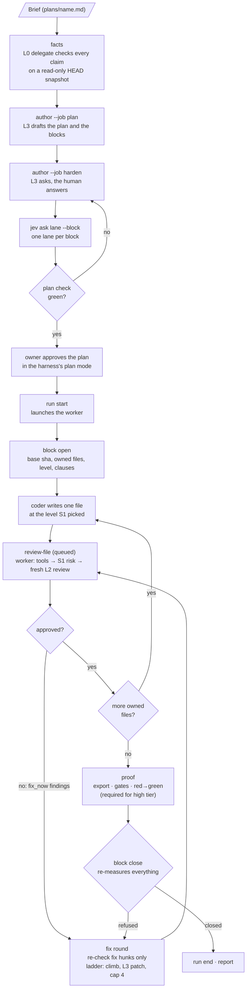
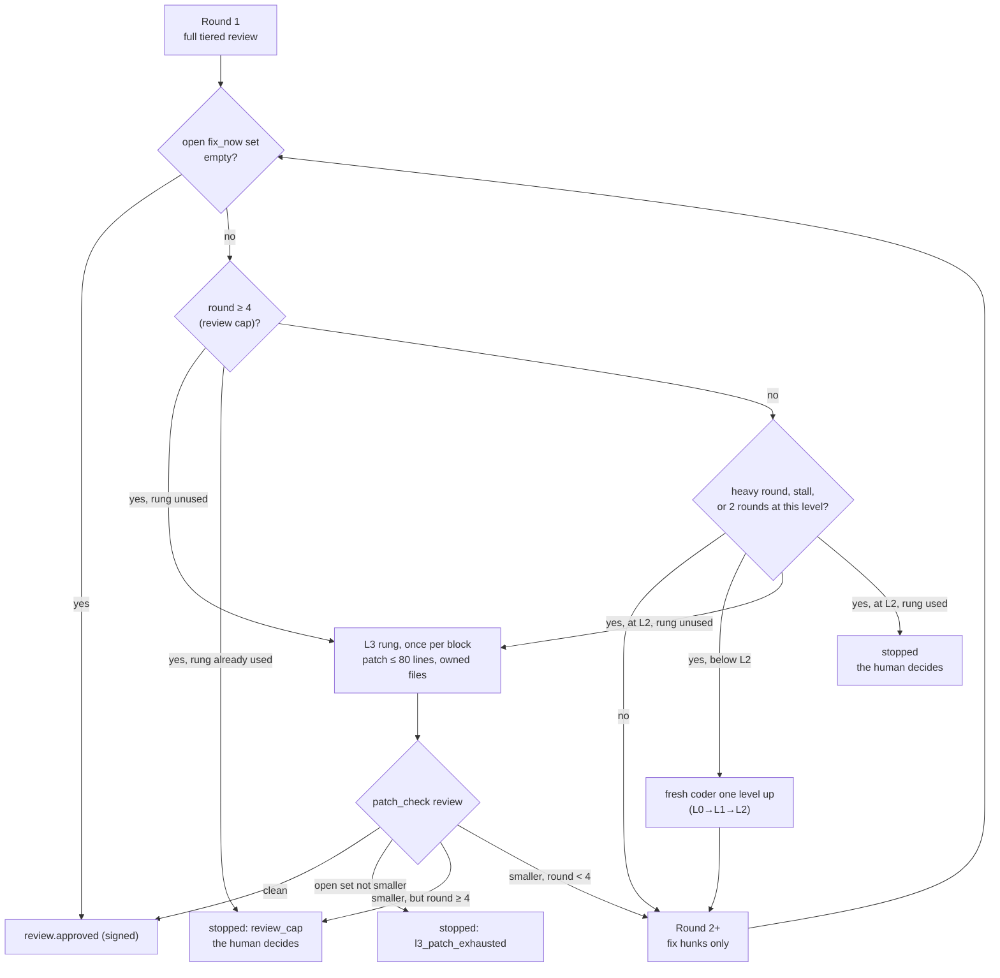

# How it works

This page follows one feature from a written brief to a closed block. The skill runs these steps
for you; every step is also a plain CLI verb you can run and inspect by hand.

## The workflow at a glance

## Step by step

| # | Step | Command | What it produces |
|---|---|---|---|
| 1 | Facts | `code-forge facts --brief plans/<name>.md` | `plans/<name>.facts.md`: every claim tagged VERIFIED, NOT-FOUND or UNVERIFIABLE, each with the command and its output line |
| 2 | Plan | `code-forge author --job plan --brief plans/<name>.md --facts plans/<name>.facts.md` | `plans/<name>.plan.md` plus a list of questions. Refuses without a facts sheet (exit 2) or with a sheet older than the brief |
| 3 | Harden | `code-forge author --job harden --brief … --facts … --draft plans/<name>.plan.md --answers <file> --out plans/<name>.plan.md` | a new draft; repeat until no blocking question is left |
| 4 | Lanes | `code-forge jev ask lane --block B1 --plan plans/<name>.plan.md --state <file>` per block (add `--rules` without Jev) | a `decision` row with the block's lane. The plan's level for the block must match it |
| 5 | Plan check | `code-forge plan check plans/<name>.plan.md` | `plan check: ok (<n> blocks)` or one line per failing rule, exit 1; then `lanes: B1 L1 (jev) · B2 L0 (rules)` |
| 5a | Approval | under the skill: the orchestrator shows the checked plan in the harness's plan mode (Claude Code: EnterPlanMode → ExitPlanMode) | your yes. No block starts before it. A harness without a plan mode shows the plan and waits for an explicit yes |
| 6 | Run start | `code-forge run start --run <run>` | `run <run> started · engine <e> · worker pid <n>`, a per-run signing key, the review worker |
| 7 | Block open | `code-forge block open B1 --run <run> --level L1 --owned <paths…> --acceptance <file> --brief <file> --lines <n>` (`--kind docs` for a docs block) | a `dispatch` ledger row and the pointer `BRIEF <path> lines=<n> sha=<sha8> <<<EOM>>>` for the coder |
| 8 | Code | the engine starts the coder with the pointer | the coder replies `ACK <sha8> lines=<n>`, then its facts diff and forecast, then code, file by file |
| 9 | Review per file | `code-forge review-file <path> --block B1 --run <run>`, then `review-file --wait <ticket>` | a verdict packet (or `status: pending` when `--max`, default 90s, passes first: wait again); a signed `review.approved` row when the file converges |
| 10 | Proof | `code-forge proof export B1 --run <run>`, `code-forge gates run --cwd <export dir>`, `code-forge proof red-green B1 --run <run> --test <file::case>` | gates measured in a clean export; one signed `proof` row per proven test |
| 11 | Close | `code-forge block close B1 --run <run> --report <coder report>` | `block B1 closed`, or the reason it stays open |
| 12 | Report | `code-forge run end --run <run>` then `code-forge report --slug <slug>` | the worker stops; 13 report sections, from `cost_per_block` to `run_stop_counts`, then the spend per run and the total |

The coder's turn ends with `===BLOCK <id> COMPLETE===` or `===BLOCK <id> FAILED: <reason>===`.
Nothing else counts as completion. Its report also lists one `reviewed <path> ticket <id>` line per
changed file. With `--report`, `block close` treats a report that misses one as FAILED, whatever its
sentinel says (`coder report FAILED: no review-file ticket id for <files>`).

### Lanes and the plan check

The plan author writes a level for each block, but the level is not its choice. For each block the
orchestrator asks System 1 for the lane (`jev ask lane --block <id> --plan <plan>`) and the answer
is written to the ledger. Without a Jev key, `--rules` answers from facts in the state file (files
changed, lines added, migration, policy or middleware paths, a high-risk path, keywords). `plan
check` then refuses a block with no recorded lane, or a level that differs from it:
`block B2: level L2 differs from the recorded lane L1 (jev)`. Every verb uses the project
root's config and ledger, so it can run from any folder of the project. The project root is the
nearest regular `.code-forge.yml` up to the git top level, else the git top level. Outside git, the
search stops at your home folder, and a `.git` in your home folder (a dotfiles repo) does not count.

Acceptance clauses in a block row are numbered `(1) … · (2) …` (or separated by `;`); `plan check`
checks each one. A clause citing a claim the facts sheet does not mark VERIFIED needs a line in the
section "Acceptance clauses the facts sheet cannot back": a list item that names the block, the
claim and the word `tolerance`, for example
``- B3 `--flag` (F4, UNVERIFIABLE) — tolerance: the test reads the help fixture``.

The plan must also use the template's exact section headings. A heading that is close but not exact,
at the right place, passes with a `WARN` that names the exact heading.

### Cost and the budget

Every session row in the ledger carries an estimated `usd`. With `budget.usd` set, each new session
first adds up the run's spend: at 80% one warning, at 100% the session is refused. `run status`
and `report` show the spend; `ledger add coder --usd <n>` adds spend code-forge did not see.
Sessions that run together each reserve their estimated cost first, so they cannot spend past the
budget together (see [Several files at once](#several-files-at-once)).

The orchestrator watches the spend during the whole run, not only at the end: it reads `run
status` after every block close and records cloud or hand-run coder spend at once. When the
budget stops work, it shows you the numbers and waits. Only you raise `budget.usd`, at most once
per run. See [getting-started.md](getting-started.md#set-a-budget).

### Changing the config mid-run

`run start` takes a snapshot of `.code-forge.yml` into the run record, and the worker reviews with
that snapshot. To change the config while blocks are open (a model swap, the review topology),
edit the file and run `code-forge run reload --run <run>`:

- the file is validated first; an invalid file is refused and nothing changes;
- it prints the changed key paths (never the values) and writes a signed `run.reload` ledger row
  with those paths and the old and new snapshot hashes; no change prints `no config change` and
  writes no row;
- open blocks stay open with their attempt numbers; review tickets already queued finish on the
  config they were enqueued with, new tickets use the new one, and the worker picks it up without
  a restart;
- `project.slug`, `engine`, `tmp.root`, `keys`, `system1.key` and `version` are fixed for the run:
  a change to one is refused with the key's name. End the run and start a new one to change them;
- while an autopilot grant is active, a change to any limit key (budgets, thresholds, review caps,
  escalation, proof, System 1, `autopilot.*`) is refused. Only you change one, with
  `code-forge autopilot approve`.

### When you step away: autopilot

You can let a run go on while you are away. `code-forge autopilot start` grants a delegate (a
fresh closed-book L2 or L3 session) a few of your decisions for a set time: waive a warning or a
nit, one extra fix round, the coder level. Every other question that would reach you waits for
you. One live log (a Claude Docs page in Claude Code, or two Markdown files elsewhere) records
every decision for your return. See [autopilot.md](autopilot.md).

### Review only

`code-forge review` runs steps 6, 7 and 9 on changes you already have, then stops the block and ends
the run: no facts, plan, coder or proof, and the block is never closed. The files are the ones
changed since the merge base with the default branch (or `--files`). See
[review-only.md](review-only.md).

### Review per file, in detail

When a coder finishes a file it runs `review-file`. The **worker** (started by `run start`, never
by a coder) serves the ticket:

1. **Tools first.** The project's gates on that file. Red ⇒ `tools_red` back to the coder, no model review.
2. **S1 scores risk** 0–3 (path rules first). Low confidence ⇒ S2 picks the depth.
3. **Depth by risk** (multimodel off, the default; at or below `review.single_reviewer_max_risk`,
   default 1, it is always one reviewer):

   | Risk | Review |
   |---|---|
   | < 1 | one fresh L2 session, `quick` lens |
   | 1 to < 2 | one fresh L2 session, `full` lens |
   | ≥ 2 | two blind L2 sessions (correctness lens, contracts-and-security lens) plus an L3 judge |

   With `review.multimodel: true`, a file whose risk is above `review.single_reviewer_max_risk`
   gets two L2 reviewers from two providers, blind to each other, and an L3 judge **from a third
   provider** rules on both reports. Lower-risk files keep the table above. Docs and contract
   blocks never use multimodel review unless `review.multimodel_for_docs` is on.
4. **Triage.** Findings from a single reviewer go to S1 `defect`: fix now, batch to an L3 ruling,
   or log as a nit. A critical finding is always fix now: neither S1 nor the ruling makes it a nit.
   A judge's findings are final.

Every reviewer packet carries the block's acceptance clauses (from `block open --acceptance`) under
"Acceptance clauses", so the reviewer checks the change against what it must do. The clauses are
redacted and cut to fit the packet budget; a block whose clauses cannot be read is still reviewed,
with `(acceptance unavailable)` in their place.

A review counts only if the process exited 0, the JSON is valid, `reviewed_hunks` match the packet
exactly, and the output is long enough (`review.min_tokens_out`; a clean pass on a diff of 20 added
lines or fewer needs only 40 tokens). Anything else is `review.unavailable`, never approval.

A session that runs past `review.session_timeout_s` (default 300 seconds) is killed and started once
more on the same packet. Only a second timeout is `unavailable: timeout`. The ledger keeps a cleaned
tail of its stderr to explain the hang. While a long session runs, the worker keeps writing a
heartbeat, so `review-file --wait` never reports a live worker as `worker_down`.

### Several files at once

The worker keeps a **pool** of review tickets. `review.parallel_tickets` (1 to 16, default 3) is
its size. Tickets start oldest first. When one ends, the next pending one starts at once. There
is no batch to wait for.

- **Same-file rule.** The same file (in the same block) is never reviewed twice at once. If the
  coder edits a file while its review runs, the new ticket waits. A ticket for another file takes
  the free slot.
- **Block lock.** Two shared steps run one at a time per block: the budget row and the block's
  one L3 rung. So two files of one block can never both take the rung.
- **Provider limits.** Every provider has a session limit, `review.provider_concurrency`
  (defaults: anthropic 4, openai 2, xai 2). A session waits for a free slot of its provider. A
  big pool never opens more sessions than the provider allows.
- **Backoff.** A rate-limited session waits about 2 seconds, then about 6 (give or take 30%),
  then tries the same step again. It does not retry at once.
- **Budget reservation.** With `budget.usd` set, each session reserves its estimated cost under
  one lock after it takes its provider slot. It gives the reservation back when its row is written
  or it fails. Sessions that start together cannot spend past the budget. A refusal says how much
  running sessions hold and what this session's estimate is.
- **A crash stays small.** A ticket that throws is that ticket's `unavailable` result. The others
  keep going.
- **Stop.** On `run end` or a stop, no new ticket starts. Tickets that are running finish. Tickets
  still queued stay on disk for the next worker.
- **Change the size mid-run.** `code-forge run reload --run <run>` changes the pool size. Queued
  tickets keep the config they were queued with.

With `review.parallel_tickets: 1` the worker reviews one file at a time, as before.
`code-forge doctor` shows the effective numbers in its `review concurrency` row.

### Fix rounds and the escalation ladder

- Round 1 reviews the whole file packet. Round 2 and later review **only the fix hunks** and the
  open findings.
- After each round with findings still open, the **cap is checked first**
  (`review.max_rounds_per_file`, default 4):
  - round 4 still open and the block has **not** used its L3 rung ⇒ the rung fires;
  - round 4 still open and the rung is **already used** ⇒ `stopped: review_cap`.
- **A heavy round climbs at once.** Below L2, a round that leaves 2 or more open warnings (or any
  critical) moves the next fix one level up (`escalation.after_rounds_with_warnings`, default 1;
  `escalation.warning_threshold`, default 2).
- Below the cap, the open `fix_now` set must shrink every round. If it does not, that is a
  `review_stall` and the coder climbs at once; two rounds at one level
  (`escalation.review_rounds_per_level`) also climb.
- **L2 is the highest running level for a coder.** A coder never climbs past L2. At L2 the next
  step is the **L3 rung**: one fresh L3 session writes a patch of at most 80 lines inside the owned
  files. The rung fires **once per block**; a later trigger in that block stops instead.
- **After the patch** comes a `patch_check` review: clean ⇒ the file is approved; the open set not
  smaller than before the patch ⇒ `stopped: l3_patch_exhausted`; round at or over the cap ⇒
  `stopped: review_cap`; otherwise the fixes continue at L2.
- **When a file stops**, the block cannot close. The human fixes it by hand, waives the finding
  (`code-forge block waive <id> <finding-id> --run <run> --file <path> --reason <text>`), or splits
  the block.

Other escalation triggers, first rule wins: attempts at a level used up
(`escalation.retries_per_level`, default 2), review rounds at a level used up
(`escalation.review_rounds_per_level`, default 2), a security-sensitive block (starts one level
higher, at most L2), and an S2 ruling. A docs or contract block is never coded below
`levels.coder_floor_docs` (default L1): `block open` raises the level and the `dispatch` row says
`trigger: docs_floor`.

### What `block close` re-measures

| Claim | Checked by |
|---|---|
| only owned files touched | every changed or new file since the block's base must be in its `owned_files`, unchanged since `block open` recorded the tree, owned by another block of the run that is still open, or still exactly what a closed block's gate approved; anything else refuses `unowned_change <file>` (`block claim` it, or put it back). Only files under the repository top-level `.code-forge/` are not changes (for a workspace in a subdirectory, its own `.code-forge/` counts as source tree except this run's record mirror and the block's default transcript), so keep transcripts and reports there. A file a closed block of the run owns is accounted for while it is exactly the content that block's gate approved. A file an open sibling block owns is left to that block's gate: the close cannot tell which coder wrote it, so it prints a `WARN` line naming each such file |
| every file reviewed | the files are every owned file changed since the base plus every owned file with any review row for this block (so work committed before `block open` or done in another worktree is still checked, with a WARN naming the likely cause); an owned entry with no glob owns the paths below it; a block with no such file refuses `no_changes`, which only the owner's `--no-require-reviews` (confirmed at a terminal) lifts. Each needs a **signed** `review.approved` row for its current content hash, and no later review of that same content that did not approve it. A later review that left findings open refuses `not_approved <file> <finding>` per finding until it is fixed and approved again or waived; a critical finding only by the human's `block waive` |
| tests green | the gates, run again |
| clauses covered | every clause names a test that exists and passed; S1 `scope` on the other hunks |
| size | net lines against `--lines`: over 1.25 × stops the block and asks for a split |
| no rule break | a grep of the coder's transcript for forbidden commands and paths |
| high tier proven | every changed **high-tier** file has a signed red→green row with `red_kind: assertion`. Light-tier files: optional |
| rows genuine | every gate-relevant row's MAC verifies; the live worker matches the pinned pid |

`--no-require-reviews` lifts the per-file review rows and `no_changes` (never `unowned_change` or `unproven`). Only
the owner may use it: it asks for a yes at a terminal (stdin and stdout must both be terminals), has no `--yes`, and is refused while an
autopilot grant is active. It leaves a signed `gate.reviews_waived {by: human}` row.

A file is **high tier** when S1 risk ≥ 2, when it matches `proof.tiers.high.paths`, or when it is
security-sensitive. Everything else is **light tier**.

### Rules the orchestrator keeps

These come from real runs. The skill states each one (`skill/references/`):

- **Never relax a rule alone.** The orchestrator, and the autopilot delegate, never change, relax
  or remove a limit, threshold, budget, gate, forbidden command or review requirement, and never
  patch a check to make it pass. When a limit blocks work, it stops, shows you the data, proposes
  options and waits (rule R17).
- **Plan approval in plan mode.** A checked plan is shown to you in the harness's plan mode before
  any block starts.
- **Levels come from the lane.** A block's level is the lane recorded with `jev ask lane`, never a
  category the plan author picks.
- **Climb early.** A heavy round climbs the coder at once; a coder never spends three rounds at one
  level.
- **L0 never codes docs or contracts.** Those blocks start at `levels.coder_floor_docs` (L1).
- **Review cost is bounded.** One reviewer for risk 0–1; no multimodel review for docs blocks.
- **Coder reports fail closed.** A report with no review ticket id for a changed file is FAILED.
- **Cost is watched all the time.** `budget.usd` per run, spend read after every block.

## Who does what

| Role | Level | Session | Started by |
|---|---|---|---|
| Orchestrator | the session you talk to | your own | you, through the skill. **It never codes, reviews or judges.** It dispatches, re-measures and records |
| Facts delegate | L0 | read-only shell, a read-only snapshot of HEAD plus `--sources` | `code-forge facts` |
| Coder | L0, L1 or L2 (the lane S1 picks) | the project tree | the engine (Solo, harness subagent, or `code-forge spawn`) |
| Reviewer, re-check | L2 | closed book: empty cwd, packet on stdin | the worker |
| Judge | L3 (a third provider in multimodel mode) | closed book, one turn | the worker |
| System 2 | L3 | closed book, one turn | the worker, `code-forge s2` |
| Plan author | L3 | closed book, one turn | `code-forge author` |
| L3 rung | L3 | a patch ≤ 80 lines, once per block | `code-forge spawn --level L3 --role coder` |
| System 1 | Jev, a small fast classifier model from TypeSafe (outside the ladder) | an API call, typed answer + probability | the worker or the orchestrator's own CLI call, never a coder |

Closed book means an empty folder, the packet on stdin and no tools. Codex (provider `openai`) always
has a shell, so it is refused for the reviewer, judge, System 2 and plan author unless
`review.allow_open_book_codex: true`. Codex coders and the facts delegate are unchanged.

**The levels:**

| Level | Typical work |
|---|---|
| L0 | facts, triage, trivial edits |
| L1 | a plain feature that follows an existing pattern |
| L2 | money, dates, tenancy, migrations, concurrency; also every file review |
| L3 | plan, harden, judge, System 2, the one-time patch rung. **Never a running coder level** by default |

`code-forge resolve L2` prints what a level maps to on your machine: provider, model, effort,
fallback, CLI.

**System 1 and System 2.** S1 is Jev (TypeSafe). It answers typed questions (`lane`, `risk`,
`security_sensitive`, `next`, `scope`, `defect`, `resolved`) in about half a second with a
probability. Default bands: confidence ≥ 0.90 with a clear margin ⇒ S1 acts; 0.60 to 0.90 ⇒ S2
checks the answer; below 0.60 ⇒ S2 decides alone. Without a Jev key, deterministic rules answer
what they can and S2 answers the rest (`system1.fallback: rules`, the default).

## Where state lives

| Place | What is in it | Committed? |
|---|---|---|
| `.code-forge.yml` (repo root) | provider, level matrix, review mode, gates, proof settings, key **references** | yes |
| `plans/` (`project.plans_dir`) | brief, facts sheet, plan, answers, block records | yes |
| `.code-forge/` (repo) | review queue (`queue/`), review results (`reviews/<run>/`), run mirror and coder logs (`runs/<run>/`), measurement exports (`export/<block>/`) | no |
| `~/.code-forge/runs/<run>.json` | the **authoritative** run record: active blocks, base sha, owned files, the pinned worker | no |
| `~/.code-forge/runs/<run>.key` | the per-run signing key, mode 0600 | no |
| `~/.code-forge/ledger/<slug>.jsonl` | the ledger: append-only, one JSON row per event | no |
| `~/.code-forge/logs/`, `installs.json`, `cache/` | init logs, the error log (`errors.jsonl`) and the last command names (`breadcrumbs.json`), where the skill is installed, model catalog cache | no |
| run temp root | `<tmp.root>/<run>/`, default `<os tmpdir>/code-forge/<run>/`. Empty cwds for closed-book sessions, the facts snapshot, pid registry. Swept by the next `run start` | no |

A new session takes over from the run record, then `code-forge ledger tail --slug <slug>`, then
the plan file. See `skill/references/continuity.md`.

## Security in short

- **Keys only where they are needed.** `.code-forge.yml` holds references (`env:NAME`,
  `keychain:<name>`, `op://…`, `user`), never values. Keys resolve in this order: environment →
  OS keychain → 1Password (cached 8 hours) → ask at setup. They resolve only in the worker and the
  orchestrator's own CLI calls.
- **Coders get no keys.** A coder process receives neither the Jev key nor the signing key.
- **One forbidden list, rendered per harness.** Force pushes, `git reset --hard`, `git stash`,
  `rm -rf` outside `.code-forge/`, reading `~/.code-forge/runs/`, starting a worker, `run start`, `run reload`,
  `block waive`, `autopilot`, writing review results, and more. It becomes each CLI's own deny rules
  (`--disallowedTools` for Claude, an execpolicy rules file plus prose for Codex), is copied into
  every brief, and is grepped from every transcript at `block close`. A hit is a `rule_break`.
- **Signed rows.** Every gate-relevant ledger row carries an HMAC made with the per-run key. A
  forged, edited or stale approval is refused, and a replaced worker stops the block.
- **Closed-book reviews.** Reviewers, judges, System 2 and the plan author get no tools. Codex
  cannot run that way, so it is refused for those roles (`validate` warns, `doctor` fails its
  isolation row) unless you set `review.allow_open_book_codex: true`.
- **A local, cleaned error log.** Failed verbs are logged on your machine with flag names only,
  never values, and with paths, project names and 1Password references replaced. Nothing is sent
  unless you run `logs report` and say yes. See [privacy.md](privacy.md).
- **Same-user boundary only.** A process running as your OS user can read the key file. The
  signature makes tampering deliberate and visible; it does not make it impossible. `doctor`
  prints `signer: same-user boundary only` on every full run. For a real boundary, run coders as
  a second OS user or in a container.

Details: `skill/references/security.md`.
