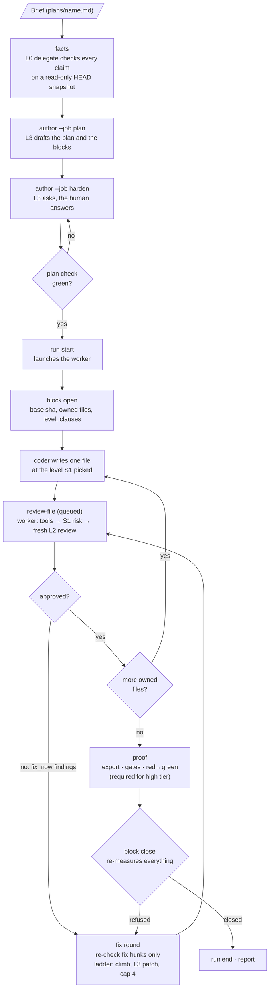
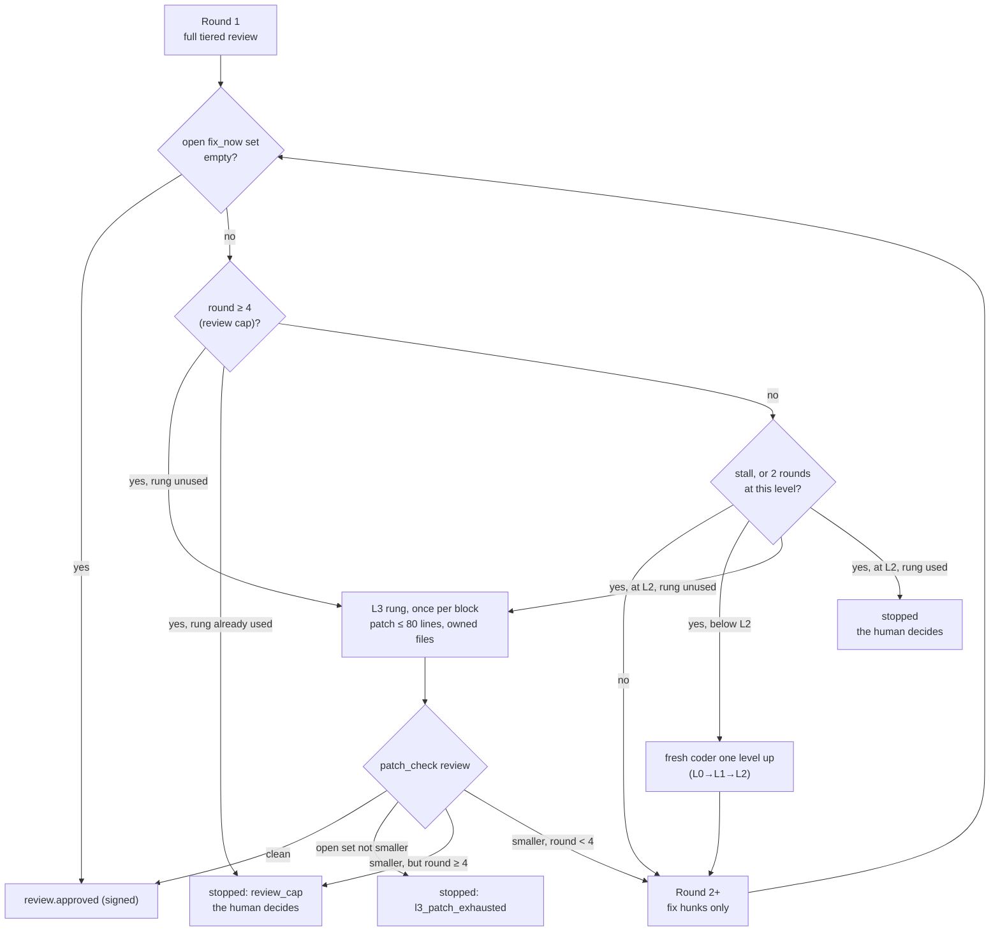

# How it works

This page follows one feature from a written brief to a closed block. The skill runs these steps
for you; every step is also a plain CLI verb you can run and inspect by hand.

## The workflow at a glance

## Step by step

| # | Step | Command | What it produces |
|---|---|---|---|
| 1 | Facts | `code-forge facts --brief plans/<name>.md` | `plans/<name>.facts.md`: every claim tagged VERIFIED, NOT-FOUND or UNVERIFIABLE, each with the command and its output line |
| 2 | Plan | `code-forge author --job plan --brief plans/<name>.md --facts plans/<name>.facts.md` | `plans/<name>.plan.md` plus a list of questions. Refuses without a facts sheet (exit 2) or with a sheet older than the brief |
| 3 | Harden | `code-forge author --job harden --brief … --facts … --draft plans/<name>.plan.md --answers <file> --out plans/<name>.plan.md` | a new draft; repeat until no blocking question is left |
| 4 | Plan check | `code-forge plan check plans/<name>.plan.md` | `plan check: ok (<n> blocks)` or one line per failing rule, exit 1 |
| 5 | Run start | `code-forge run start --run <run>` | `run <run> started · engine <e> · worker pid <n>`, a per-run signing key, the review worker |
| 6 | Block open | `code-forge block open B1 --run <run> --level L1 --owned <paths…> --acceptance <file> --brief <file> --lines <n>` | a `dispatch` ledger row and the pointer `BRIEF <path> lines=<n> sha=<sha8> <<<EOM>>>` for the coder |
| 7 | Code | the engine starts the coder with the pointer | the coder replies `ACK <sha8> lines=<n>`, then its facts diff and forecast, then code, file by file |
| 8 | Review per file | `code-forge review-file <path> --block B1 --run <run>`, then `review-file --wait <ticket>` | a verdict packet; a signed `review.approved` row when the file converges |
| 9 | Proof | `code-forge proof export B1 --run <run>`, `code-forge gates run --cwd <export dir>`, `code-forge proof red-green B1 --run <run> --test <file::case>` | gates measured in a clean export; one signed `proof` row per proven test |
| 10 | Close | `code-forge block close B1 --run <run>` | `block B1 closed`, or the reason it stays open |
| 11 | Report | `code-forge run end --run <run>` then `code-forge report --slug <slug>` | the worker stops; 13 report sections, from `cost_per_block` to `run_stop_counts` |

The coder's turn ends with `===BLOCK <id> COMPLETE===` or `===BLOCK <id> FAILED: <reason>===`.
Nothing else counts as completion.

### Review only

`code-forge review` runs steps 5, 6 and 8 on changes you already have, then stops the block and ends
the run: no facts, plan, coder or proof, and the block is never closed. The files are the ones
changed since the merge base with the default branch (or `--files`). See
[review-only.md](review-only.md).

### Review per file, in detail

When a coder finishes a file it runs `review-file`. The **worker** (started by `run start`, never
by a coder) serves the ticket:

1. **Tools first.** The project's gates on that file. Red ⇒ `tools_red` back to the coder, no model review.
2. **S1 scores risk** 0–3 (path rules first). Low confidence ⇒ S2 picks the depth.
3. **Depth by risk** (multimodel off, the default):

   | Risk | Review |
   |---|---|
   | < 1 | one fresh L2 session, `quick` lens |
   | 1 to < 2 | one fresh L2 session, `full` lens |
   | ≥ 2 | two blind L2 sessions (correctness lens, contracts-and-security lens) plus an L3 judge |

   With `review.multimodel: true`, two L2 reviewers from two providers read the file blind, and an
   L3 judge **from a third provider** rules on both reports.
4. **Triage.** Findings from a single reviewer go to S1 `defect`: fix now, batch to an L3 ruling,
   or log as a nit. A judge's findings are final.

Every reviewer packet carries the block's acceptance clauses (from `block open --acceptance`) under
"Acceptance clauses", so the reviewer checks the change against what it must do. The clauses are
redacted and cut to fit the packet budget; a block whose clauses cannot be read is still reviewed,
with `(acceptance unavailable)` in their place.

A review counts only if the process exited 0, the JSON is valid, `reviewed_hunks` match the packet
exactly, and the output is long enough. Anything else is `review.unavailable`, never approval.

### Fix rounds and the escalation ladder

- Round 1 reviews the whole file packet. Round 2 and later review **only the fix hunks** and the
  open findings.
- After each round with findings still open, the **cap is checked first**
  (`review.max_rounds_per_file`, default 4):
  - round 4 still open and the block has **not** used its L3 rung ⇒ the rung fires;
  - round 4 still open and the rung is **already used** ⇒ `stopped: review_cap`.
- Below the cap, the open `fix_now` set must shrink every round. If it does not, that is a
  `review_stall` and the coder climbs at once; two rounds at one level
  (`escalation.review_rounds_per_level`) also climb.
- **L2 is the highest running level for a coder.** A coder never climbs past L2. At L2 the next
  step is the **L3 rung**: one fresh L3 session writes a patch of at most 80 lines inside the owned
  files. The rung fires **once per block**; a later trigger in that block stops instead.
- **After the patch** comes a `patch_check` review: clean ⇒ the file is approved; the open set not
  smaller than before the patch ⇒ `stopped: l3_patch_exhausted`; round at or over the cap ⇒
  `stopped: review_cap`; otherwise the fixes continue at L2.
- **When a file stops**, the block cannot close. The human fixes it by hand, waives the finding
  (`code-forge block waive <id> <finding-id> --run <run> --file <path> --reason <text>`), or splits
  the block.

Other escalation triggers, first rule wins: attempts at a level used up
(`escalation.retries_per_level`, default 2), review rounds at a level used up
(`escalation.review_rounds_per_level`, default 2), a security-sensitive block (starts one level
higher, at most L2), and an S2 ruling.

### What `block close` re-measures

| Claim | Checked by |
|---|---|
| only owned files touched | the file set against `owned_files`; anything else is an orphan (`block claim` or delete it) |
| every file reviewed | a **signed** `review.approved` row for the current content hash of every changed or new file |
| tests green | the gates, run again |
| clauses covered | every clause names a test that exists and passed; S1 `scope` on the other hunks |
| size | net lines against `--lines`: over 1.25 × stops the block and asks for a split |
| no rule break | a grep of the coder's transcript for forbidden commands and paths |
| high tier proven | every changed **high-tier** file has a signed red→green row with `red_kind: assertion`. Light-tier files: optional |
| rows genuine | every gate-relevant row's MAC verifies; the live worker matches the pinned pid |

A file is **high tier** when S1 risk ≥ 2, when it matches `proof.tiers.high.paths`, or when it is
security-sensitive. Everything else is **light tier**.

## Who does what

| Role | Level | Session | Started by |
|---|---|---|---|
| Orchestrator | the session you talk to | your own | you, through the skill. **It never codes, reviews or judges.** It dispatches, re-measures and records |
| Facts delegate | L0 | read-only shell, a read-only snapshot of HEAD plus `--sources` | `code-forge facts` |
| Coder | L0, L1 or L2 (the lane S1 picks) | the project tree | the engine (Solo, harness subagent, or `code-forge spawn`) |
| Reviewer, re-check | L2 | closed book: empty cwd, packet on stdin | the worker |
| Judge | L3 (a third provider in multimodel mode) | closed book, one turn | the worker |
| System 2 | L3 | closed book, one turn | the worker, `code-forge s2` |
| Plan author | L3 | closed book, one turn | `code-forge author` |
| L3 rung | L3 | a patch ≤ 80 lines, once per block | `code-forge spawn --level L3 --role coder` |
| System 1 | Jev, a small fast classifier model from TypeSafe (outside the ladder) | an API call, typed answer + probability | the worker or the orchestrator's own CLI call, never a coder |

**The levels:**

| Level | Typical work |
|---|---|
| L0 | facts, triage, trivial edits |
| L1 | a plain feature that follows an existing pattern |
| L2 | money, dates, tenancy, migrations, concurrency; also every file review |
| L3 | plan, harden, judge, System 2, the one-time patch rung. **Never a running coder level** by default |

`code-forge resolve L2` prints what a level maps to on your machine: provider, model, effort,
fallback, CLI.

**System 1 and System 2.** S1 is Jev (TypeSafe). It answers typed questions (`lane`, `risk`,
`security_sensitive`, `next`, `scope`, `defect`, `resolved`) in about half a second with a
probability. Default bands: confidence ≥ 0.90 with a clear margin ⇒ S1 acts; 0.60 to 0.90 ⇒ S2
checks the answer; below 0.60 ⇒ S2 decides alone. Without a Jev key, deterministic rules answer
what they can and S2 answers the rest (`system1.fallback: rules`, the default).

## Where state lives

| Place | What is in it | Committed? |
|---|---|---|
| `.code-forge.yml` (repo root) | provider, level matrix, review mode, gates, proof settings, key **references** | yes |
| `plans/` (`project.plans_dir`) | brief, facts sheet, plan, answers, block records | yes |
| `.code-forge/` (repo) | review queue (`queue/`), review results (`reviews/<run>/`), run mirror and coder logs (`runs/<run>/`), measurement exports (`export/<block>/`) | no |
| `~/.code-forge/runs/<run>.json` | the **authoritative** run record: active blocks, base sha, owned files, the pinned worker | no |
| `~/.code-forge/runs/<run>.key` | the per-run signing key, mode 0600 | no |
| `~/.code-forge/ledger/<slug>.jsonl` | the ledger: append-only, one JSON row per event | no |
| `~/.code-forge/logs/`, `installs.json`, `cache/` | init logs, where the skill is installed, model catalog cache | no |
| run temp root | `<tmp.root>/<run>/`, default `<os tmpdir>/code-forge/<run>/`. Empty cwds for closed-book sessions, the facts snapshot, pid registry. Swept by the next `run start` | no |

A new session takes over from the run record, then `code-forge ledger tail --slug <slug>`, then
the plan file. See `skill/references/continuity.md`.

## Security in short

- **Keys only where they are needed.** `.code-forge.yml` holds references (`env:NAME`,
  `keychain:<name>`, `op://…`, `user`), never values. Keys resolve in this order: environment →
  OS keychain → 1Password (cached 8 hours) → ask at setup. They resolve only in the worker and the
  orchestrator's own CLI calls.
- **Coders get no keys.** A coder process receives neither the Jev key nor the signing key.
- **One forbidden list, rendered per harness.** Force pushes, `git reset --hard`, `git stash`,
  `rm -rf` outside `.code-forge/`, reading `~/.code-forge/runs/`, starting a worker, `run start`,
  `block waive`, writing review results, and more. It becomes each CLI's own deny rules
  (`--disallowedTools` for Claude, an execpolicy rules file plus prose for Codex), is copied into
  every brief, and is grepped from every transcript at `block close`. A hit is a `rule_break`.
- **Signed rows.** Every gate-relevant ledger row carries an HMAC made with the per-run key. A
  forged, edited or stale approval is refused, and a replaced worker stops the block.
- **Same-user boundary only.** A process running as your OS user can read the key file. The
  signature makes tampering deliberate and visible; it does not make it impossible. `doctor`
  prints `signer: same-user boundary only` on every full run. For a real boundary, run coders as
  a second OS user or in a container.

Details: `skill/references/security.md`.
