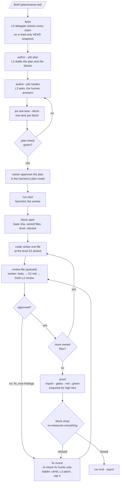
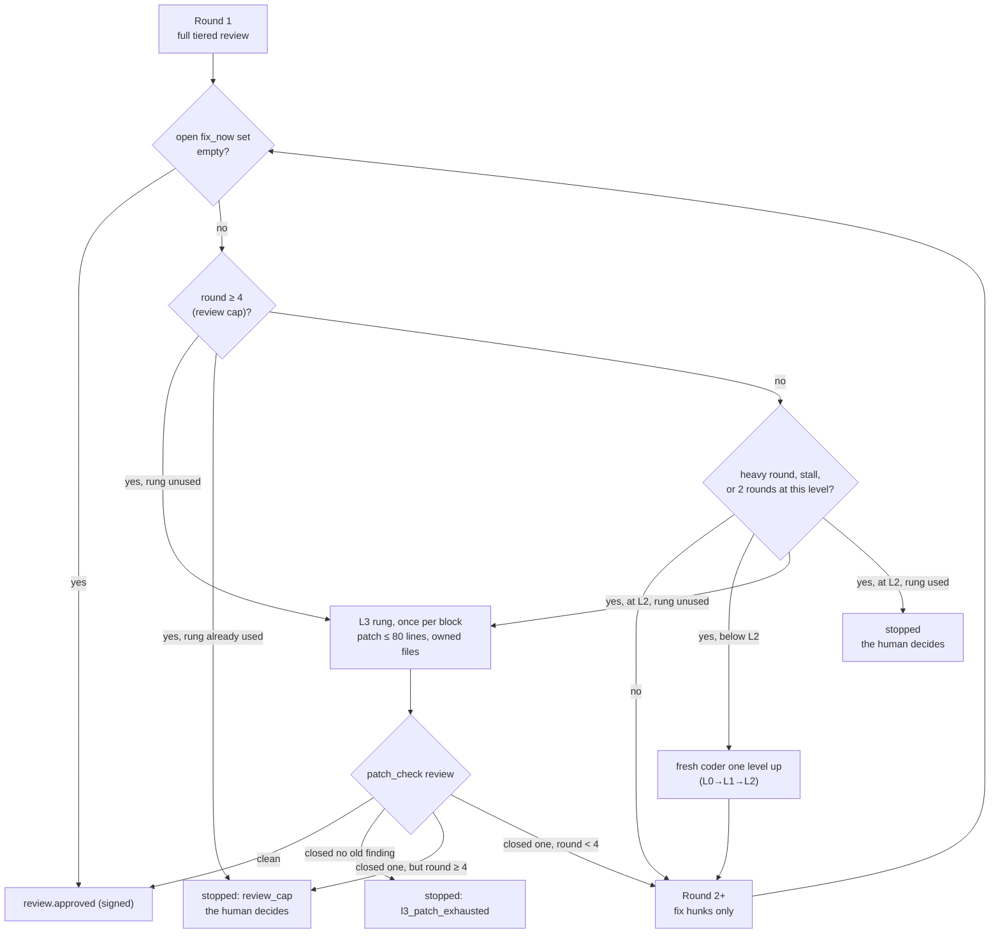

# How it works

This page follows one feature from a written brief to a closed block. The skill runs these steps
for you; every step is also a plain CLI verb you can run and inspect by hand.

Red→green: each new or changed test must FAIL on the old code first (red), then PASS on the new code (green). A red caused by an import, compile or crash error proves nothing; the red must be an assertion failure.

## The workflow at a glance


```mermaid
flowchart TD
  brief[/"Brief (plans/name.md)"/] --> facts["facts<br/>L0 delegate checks every claim<br/>on a read-only HEAD snapshot"]
  facts --> author["author --job plan<br/>L3 drafts the plan and the blocks"]
  author --> harden["author --job harden<br/>L3 asks, the human answers"]
  harden --> lanes["jev ask lane --block<br/>one lane per block"]
  lanes --> check{"plan check<br/>green?"}
  check -- no --> harden
  check -- yes --> approve["owner approves the plan<br/>in the harness's plan mode"]
  approve --> start["run start<br/>launches the worker"]
  start --> open["block open<br/>base sha, owned files, level, clauses"]
  open --> coder["coder writes one file<br/>at the level S1 picked"]
  coder --> rf["review-file (queued)<br/>worker: tools → S1 risk → fresh L2 review"]
  rf --> verdict{"approved?"}
  verdict -- "no: fix_now findings" --> fix["fix round<br/>re-check fix hunks only<br/>ladder: climb, L3 patch, cap 4"]
  fix --> rf
  verdict -- yes --> more{"more owned<br/>files?"}
  more -- yes --> coder
  more -- no --> proof["proof<br/>export · gates · red→green<br/>(required for high tier)"]
  proof --> close{"block close<br/>re-measures everything"}
  close -- refused --> fix
  close -- closed --> report["run end · report"]
```

## Step by step

| # | Step | Command | What it produces |
|---|---|---|---|
| 1 | Facts | `code-forge facts --brief plans/<name>.md` | `plans/<name>.facts.md`: every claim tagged VERIFIED, NOT-FOUND or UNVERIFIABLE, each with the command and its output line |
| 2 | Plan | `code-forge author --job plan --brief plans/<name>.md --facts plans/<name>.facts.md` | `plans/<name>.plan.md` plus a list of questions. Refuses without a facts sheet (exit 2) or with a sheet older than the brief |
| 3 | Harden | `code-forge author --job harden --brief … --facts … --draft plans/<name>.plan.md --answers <file> --out plans/<name>.plan.md` | a new draft; repeat until no blocking question is left |
| 4 | Lanes | `code-forge jev ask lane --block B1 --plan plans/<name>.plan.md --state <file>` per block (add `--rules` without Jev) | a `decision` row with the block's lane. The plan's level for the block must match it |
| 5 | Plan check | `code-forge plan check plans/<name>.plan.md` | `plan check: ok (<n> blocks)` or one line per failing rule, exit 1; then `lanes: B1 L1 (jev) · B2 L0 (rules)` |
| 5a | Approval | under the skill: the orchestrator shows the checked plan in the harness's plan mode (Claude Code: EnterPlanMode → ExitPlanMode) | your yes. No block starts before it. A harness without a plan mode shows the plan and waits for an explicit yes |
| 6 | Run start | `code-forge run start --run <run>` | `run <run> started · engine <e> · worker pid <n>`, a per-run signing key, the review worker. With `--mode brief` (briefs, no plan; steps 1–5a are skipped) it prints `· mode brief (no plan)` and writes a signed `run.mode {mode: brief, plan: none}` row; the mode is fixed for the run, and any value other than `plan` or `brief` is a usage error (exit 2). A full brief-mode run, with an outside reviewer, related tests and worktrees: [brief-mode.md](brief-mode.md) |
| 7 | Block open | `code-forge block open B1 --run <run> --level L1 --owned <paths…> --acceptance <file> --brief <file> --lines <n>` (`--kind docs` for a docs block; `--tests <paths…>` names the block's test files for a `{test_files}` gate). In a brief-mode run `--level` may be left out: the rules pick the lane from the owned entries, `--lines` and `proof.tiers.high.paths` (a high, migration or policy/middleware path ⇒ L2; more than 4 entries or 200 lines ⇒ L1; else L0) and a signed `decision` row with `source: rules` names the block and the lane | a `dispatch` ledger row and the pointer `BRIEF <path> lines=<n> sha=<sha8> <<<EOM>>>` for the coder. Refused when an owned path overlaps another open block's. An owned path with no glob character (`*`, `?`, `{`) owns itself and every path below it: `src/feature` owns `src/feature/a.swift` (not `src/featureX/a.swift`), so it overlaps `src/feature/x.swift` or `src` in another block. A path that is a regular file when the block opens (or when `block claim` adds it) owns only itself, so `src/README` and `src/**/*.mjs` do not overlap; a path not there yet stays a possible directory. A brace entry (`src/{a,b}`) is a glob: each name owns only itself. Block open, claim, rebase, the scope and close gates, proof, the plan check and the worker all use this one rule |
| 7a | Context pack | `code-forge context pack --run <run> --block B1` (with a `context` key in the config) | `<run root>/context/B1.md` and `tokens ~<n>` (`--json`: path, tokens, lines, cut, sha256); a signed `context.pack` row when the pack is new. The orchestrator sends the file with every coder task — see [The context pack](#the-context-pack) |
| 8 | Code | the engine starts the coder with the pointer | the coder replies `ACK <sha8> lines=<n>`, then its facts diff and forecast, then code, file by file |
| 9 | Review per file | `code-forge review-file <path> --block B1 --run <run>`, then `review-file --wait <ticket>` | a verdict packet (or `status: pending` when `--max`, default 90s, passes first: wait again); a signed `review.approved` row when the file converges |
| 10 | Proof | `code-forge proof export B1 --run <run>`, `code-forge gates run --cwd <export dir>`, `code-forge proof red-green B1 --run <run> --test <file>[::<case>]` (the `::<case>` is needed only when the matched runner's argv has `{test_filter}`) | gates measured in a clean export (dependency folders linked, a Composer `vendor` copied; verified on Node and on Laravel with PHPUnit and Pest; red→green verified on Laravel with PHPUnit and Pest through `php artisan test`, on Swift, and on Xcode through `xcodebuild test` on an iOS simulator); one signed `proof` row per proven test. With `--run <run> --block B1`, a gate argv item that is exactly `{test_files}` runs only the block's tests (its `--tests`, else its owned test files), or the full suite above `gates.full_suite_threshold_files` owned files (globs and directories count the tracked and new (not ignored) files they cover; `reason: threshold`) or when none is known or no `--run/--block` is given (`reason: no_tests`); `gate.done` records `scope: related \| full` with `test_count` or the reason. A gate given as `{argv, env}` runs with those variables; code-forge shows only their names, and masks a value of 8+ characters in the gate's own output. A test that is not a `node:test` file is proven through a `proof.runners` entry (match globs, an adapter, an argv with `{test_file}`, `{test_id}`, `{test_filter}` and `{report}`): it runs the entry's argv and reads its JUnit report; the list is fixed in the run snapshot at `run start`, and the `proof` row and the JSON add `runner`, `env_keys` (the entry's env names only) and `failed_tests`, a bounded list of test names (at most 20, each cut at 200 characters, control characters removed); the full list of failed ids (`failed_ids`) is never stored. A Laravel test proves through `[php, artisan, test, "{test_file}", --filter, "{test_filter}", --log-junit, "{report}"]` with `--test <file>::<method or Pest description>`: `{test_filter}` is the case, regex-escaped, and PHPUnit and Pest read `--filter` as a regex, so a Pest description with `( ) [ ] . + ? /` is safe; a test of a class the block added is `RED_INVALID` `import`, from Laravel's plain console and from the JSON summary it prints under an AI agent |
| 10a | Progress | `code-forge status` (`--run <run>` for one run, `--json` for one line) | read-only, at most 10 lines per active run of this repository — see [Checking progress](#checking-progress) |
| 11 | Close | `code-forge block close B1 --run <run> --report <coder report>` | `block B1 closed`, or the reason it stays open |
| 12 | Report | `code-forge run end --run <run>` then `code-forge report --slug <slug>` | the worker stops; 14 report sections, from `cost_per_block` to `outside_review`, then the spend per run and the total |

In fix rounds, the coder may use `code-forge gates run --run <r> --block <id> --changed` for the fresh TESTS line (B99). Any green `code-forge gates run --run <r> --block <id>` records the owned file hashes on `gate.done`, including runs without `--changed`; when `--slug` is omitted, these rows go to the run's project ledger. More than 200 owned files means no record, so the next `--changed` falls back with `no_baseline`; unreadable inputs also leave no record. `{test_files}` expands to changed tests and stem-paired tests of changed sources; `{changed_files}` expands to changed lint/format paths. Deleted files still count for pairing and the threshold, but both tokens receive only files that exist now. Both tokens must be whole argv items and cannot be the command or the only item; config validation refuses a gate whose command or only item is `{changed_files}`. Without `--changed`, `{changed_files}` is dropped. Gates without tokens run as before. Rows carry `scope: changed`, including fallback rows with a `reason`: `no_baseline` uses today's scope, `unpaired` uses today's test scope when a changed source has no test pair, `threshold` runs the full suite above `gates.full_suite_threshold_files` changed files, and `no_changes` uses today's scope when nothing is left to run. The orchestrator runs the full `code-forge gates run` before `block close` (D2).

To overlap reviews with coding, set `review.file_loop: overlap` (`wait` is the default; `watch` uses the commit loop below). Enqueue each green file with `code-forge review-file <path> --block <id> --run <r>` and continue coding. Before the completion sentinel, including in fix rounds, run `code-forge review-file --wait-block <id> --run <r> [--max 90s]`. It reads the workspace scope mirror, the queue and owned changed files; it never runs a review itself. It prints one JSON line `{block, files: [{file, ticket, status}], done}` with `done`, `pending` or `not_queued` per file. Changed content with an earlier ticket gets a new current-content ticket automatically; the worker marks an old pending ticket stale at start. A file with no ticket is `not_queued` with a null ticket: enqueue it. Timeout returns exit 0 with `done: false`, `reason: wait_timeout`; wait again. No live worker for the run returns exit 3 with `status: worker_down`, always `done: false`, even with completed markers; print the FAILED sentinel. An unreadable scope, ticket or completion marker refuses (exit 1). `done: true` means finished for the current content, not approved: inspect the tickets with `--wait` and fix findings. The close still checks signed approvals independently.

With `review.file_loop: watch` (B104), commit each owned file after its tests are green and continue coding. Watch replaces per-file enqueueing. Before the completion sentinel, including fix rounds, run `code-forge review-file --wait-block <id> --run <r> [--max 90s]`, inspect finished tickets with `--wait <ticket>`, and fix findings. The worker watches the block worktree HEAD (otherwise repository HEAD), queues owned content from git objects with the same ticket ids as a manual request, and marks older pending tickets `refused`, `reason: superseded`. A running ticket finishes for its old hash, which cannot approve newer bytes; `--wait-block` joins the current ticket per file. `--fresh` refuses a superseded marker; enqueueing that content again removes only its superseded marker so it can run, while a real result stays cached. `queue/watch/<block>.json` stores the last seen commit; missing or unreadable state restarts at `base_sha` with idempotent tickets. A rewound tick queues nothing and drops the last seen commit so the next tick restarts at `base_sha`. A `watch.skipped {block, reason}` row is written once per reason until a healthy head clears the skip reasons: `unreadable_head` (head, tree or objects cannot be read), `not_descendant` (head does not descend from the block base), `rewound` (head no longer descends from the last seen commit), or `unowned_path` (unowned paths are ignored; owned paths still queue). A skip never fails the block. After a `watch.skipped` row, use `code-forge review-file <path> --block <id> --run <r>` when the file needs a manual review; use `code-forge review-file <fix file> --block <id> --run <r> --answers <ids> --of <source>` for a fix in another owned file that answers findings. Set watch before starting the worker. Without the `review.file_loop: watch` setting, the default `wait` loop performs no watch work or git calls.

The coder's turn ends with `===BLOCK <id> COMPLETE===` or `===BLOCK <id> FAILED: <reason>===`.
Nothing else counts as completion. The final report needs no `reviewed <path> ticket <id>` lines:
`block close` prints one for every file the review gate accepts (approved, waived or answered),
with the queue's ticket. The close prints the reviewed lines, then the `reviewed_by_waiver` lines,
then the `closed` line. With `--report`, a hand line that names another ticket prints
`WARN report ticket mismatch <path>` on stderr when the block closes, and the close goes on. A file
with a `review.waived` finding still gets a line; only a close with every review waived
(`--no-require-reviews`) or `review.external` prints none. The printed line has no `via`: `--json`
and the block's done file carry the lines as `reviewed: [{file, ticket, via}]`, with
`via: approved` for a file with a signed approval, `via: waiver` when at least one of its open
findings was waived (also when the others were answered), and `via: answered` when every one was
answered.

Two cases give a file the gate accepts no line. A file the gate accepts gets no line when the queue
cannot give its ticket (its content changed after the gate read it, or its path cannot be
resolved): the close prints `WARN no ticket for <path>`, or `WARN bad ticket for <path>` when the
ticket is not 24 lowercase hex characters. If the lines cannot be built at all, the close still goes
on, with no line and one `WARN reviewed lines unavailable: <message>`. Like the mismatch WARN, these
go to stderr and print only when the block closes; a refused close prints none of them. The close
refuses `coder report FAILED: no review-file ticket id for <files>` only when, under `--report`, a
file the review gate accepts has no reviewed line from the close and no hand line for it in the
report.

### Checking progress

`code-forge status` (B64a) is how the orchestrator checks progress, instead of reading logs or
polling the coder's transcript. It is read-only: it writes no ledger row and no file beyond the
breadcrumb every verb writes, and it never takes the run lock, so it never blocks a worker or a
block verb (nor waits on them). It shows every run that is not ended whose workspace is the
current repository, newest first, with one blank line between runs, in at most 10 lines per run.
A run with ten open blocks, two closed and one stopped:

```
run <run> · active · plan · spent $1.20+? of $5.00
B1 open L1 · openai/<model> · gate fail (test) · findings 1
B2 attempt-2 L2 · - · gate pass · findings 0
B3 open L1 · - · gate none · findings 0
B4 open L1 · - · gate none · findings 0
B5 open L0 · - · gate none · findings 0
B6 open L1 · - · gate none · findings 0
B7 open L1 · - · gate none · findings 0
… +3 more blocks
closed 2 · stopped 1
```

- **Line 1**: the run, its status, its mode (`plan` or `brief`) and the spend: `run status`'s
  spent_usd with 2 decimals, followed by `+?` when at least one session has no known price (its
  cost is not in the sum), or `$?` alone when the ledger cannot be read. ` of $<budget>` shows
  only with `budget.usd` set.
- **One line per open or in-attempt block**, in block id order: its state (`open`, or
  `attempt-<n>`), its level, the model of its latest coder session row (`-` when the ledger names
  none), its last gate run and its open findings — the number of review findings the close gate
  (`checkBlockReviews`) would refuse today. The gate field is printed as `gate pass`, `gate fail
  (<gate>)` (the failing gate named by the last `gate.red` of that run), `gate fail` (a failed run
  with no named gate) or `gate none` (no gate ran yet).
- **`… +<k> more blocks`** is the last block line when the blocks do not fit.
- **`closed <a> · stopped <b>`** shows only when either is non-zero. It is printed LAST, but it
  keeps its place in the 10-line cap ahead of block lines: when the lines do not fit, block lines
  are dropped first, never this one.

With no such run it prints `no active run` (exit 0). `--run <run>` shows that run, even ended; an
unknown run exits 1 (`status: no run record for <run>`), and a usage error (an unknown flag, an
argument) exits 2. `--json` prints exactly one line, `{"runs":[{run_id, status, mode, spent_usd,
unknown_usd_sessions, budget_usd, blocks: [{id, state, level, model, gate: {result, name},
findings}], more, closed, stopped}]}`, with every open block (no cap) and `more` always 0;
`gate.result` is `pass`, `fail` or `none`, and `gate.name` is the failing gate's name, or null for
`pass`, for `none` and for a fail with no named gate; `spent_usd` and `unknown_usd_sessions` are
null when the ledger cannot be read. Transcript and diff text are never printed.

Every block verb also takes `--json`. On success stdout is exactly one line,
`{"block":<id>,"event":<event>,…}`:

| Verb | `event` | Other fields |
|---|---|---|
| `open` | `open` | `level`, `asked`, `source` (`flag`, `rules` or `autopilot`), `kind`, `attempt`, `base_sha` (full), `tests` (count), `worktree` (`{path, branch, reused}` or null), `brief` (the pointer or null) |
| `attempt` | `attempt` | `attempt` |
| `rebase` | `rebased` | `old_base`, `new_base` |
| `claim` | `claimed` | `path` |
| `close` | `closed` | `status`, `reason`, `close_event` (or null); when a file passed as reviewed by waiver also `reviewed_by_waiver` (`[{file, content_hash, status, findings, by}]`); with `--remove-worktree` also `worktree` (`{removed, path, branch}`; a block with no worktree refuses `--remove-worktree` as a usage error, exit 2); with `hooks.on_block_end` set also `done_file` when the close ended the block (closed or stopped) — see [When a block ends](#when-a-block-ends-the-done-file-and-the-hook) |
| `stop` | `stopped` | none; with `hooks.on_block_end` set, `done_file` |
| `waive` | `waived` | `finding`, `file`, `by` |

On failure the exit code and stderr are unchanged and stdout stays empty, except a close the gate
refused, which also prints `{"block":<id>,"ok":false,"reason":<text>}`; every other close refusal
(a usage error, a block not open, a cancelled `--no-require-reviews`, a failed worktree removal)
leaves stdout empty. Without `--json` the output
is byte-identical to before.

### When a block ends: the done file and the hook

A block ends when `block close` closes it, when `block close` stops it (a pin event or
`ledger.tamper`), or with `block stop` (B64b). Every end writes `<run root>/blocks/<id>.done.json`
— the run root here is the run's state folder, `~/.code-forge/runs/<run>/`, next to the run record
(never the temp folder that holds the context packs) — after the end's ledger rows, atomically (a
temp file in the same folder, then a rename); a later end of the same block overwrites it. Its
absolute path is in the hook's `CODE_FORGE_DONE_FILE` and in `done_file` of `close --json` and
`stop --json` (with the hook set). A close:

```json
{"block":"B1","run_id":"r1","status":"closed","event":"block.close","reason":null,"commit":"<sha>","spent_usd":1.25,"unknown_usd_sessions":0,"findings":0,"at":"<iso time>"}
```

A `block stop`:

```json
{"block":"B2","run_id":"r1","status":"stopped","event":"block.stop","reason":"not needed","commit":"<sha>","spent_usd":0.25,"unknown_usd_sessions":1,"findings":1,"at":"<iso time>"}
```

- `status` is `closed` or `stopped`.
- `event` is `block.close` for a close that closed the block, `block.stop` for `block stop`, and
  the close's own event (`worker.replaced`, `ledger.tamper`, …) for a close that stopped it.
- `reason` is null for a plain close; otherwise the stop reason, redacted.
- `commit` is HEAD of the block's worktree, else of the repository; null when it cannot be read.
- `spent_usd` and `unknown_usd_sessions` come from the block's own ledger rows, computed as
  `code-forge status` does; both null when the ledger cannot be read.
- `findings` is the count of open review findings, as `code-forge status` counts them; null when
  the ledger cannot be read or the count fails.

The file never holds transcript text, diff text or secrets. If it cannot be written, the result,
exit code and stdout stay the same (with the hook set, `done_file` is then null) and stderr adds
`warning: done file not written: <reason>`.

The owner can also set a command that runs at every block end:

```yaml
hooks:
  on_block_end:
    argv: [osascript, -e, 'display notification "block done"']
    timeout_s: 60     # 1–600, default 60
```

It is read from the run's config snapshot and fixed for the run (`run reload` refuses a change).
It runs once per end, after the done file and outside the run lock: no shell, cwd = the repository
top level, stdin closed, output discarded, and its process group killed at `timeout_s`. Its env adds
`CODE_FORGE_RUN`, `CODE_FORGE_BLOCK`, `CODE_FORGE_BLOCK_STATUS` and `CODE_FORGE_DONE_FILE` (the
empty string when the done file was not written). It runs even when a later step of the verb
(`--remove-worktree`) fails. One signed
`hook.ran {block, hook, argv0, exit, signal, timed_out, duration_ms}` row per block end records it,
also when the hook fails, times out or is not found (`argv0` is the basename only; `exit` is null
unless the hook exited; `signal` names the killing signal, `SIGKILL` on a timeout, else null).
A hook that does not exit 0 only warns, in one of these forms:
`warning: on_block_end hook exit N`, `… timed out`, `… not found` (argv[0] does not exist),
`… signal <NAME>`, or `… failed to start (<error code>)` (any other spawn error, a missing
repository folder included). If the `hook.ran` row itself cannot be written, stderr adds one more
line, `warning: on_block_end hook row not written (<error code>)` — an error code only, never
message text. With the hook set, `close --json` and `stop --json` add `done_file`
(the absolute path, or null when it was not written); without it, nothing changes (no hook, no row,
the same output). The hook runs outside coders. `.code-forge.yml` is non-ownable (the same
guard as `review.external.required`) with the hook set — also when `hooks.on_block_end` is the
only key that guards it — and the close gate flags a coder transcript line that runs the hook (its
argv[0] basename plus argv[1] when present and not blank, both trimmed; argv[1] is one literal
token even with spaces inside, so such an argv[1] never matches a transcript line, which is split
on spaces) as `rule_break … code-forge-on-block-end-hook`. The orchestrator waits for the done file or the hook
instead of polling. A done file from an earlier end of the same block stays after a reopen, so it
counts only when its `at` is later than the current dispatch; if no fresh done file appears by the
time the coder agent reports, the orchestrator runs `code-forge status` once.

### The context pack

With a top-level `context` key in `.code-forge.yml` (B63a), every coder task carries the same
project rules, lessons and commands:

```yaml
context:
  rules: [CLAUDE.md, docs/conventions.md]   # paths relative to the repository root, in order
  lessons: docs/lessons.md                  # one file
  commands:                                 # argv lists, each optional; never run by code-forge
    build: [npm, run, build]
    test: [npm, test]
    lint: [npm, run, lint]
    format: [npm, run, format]
  max_lines: 300                            # default 300, at least 20
```

`code-forge context pack --run <run> --block <id>` writes `<run root>/context/<id>.md`:

- a header: run, block, level, owned files, test files (from `--tests`) and, for a worktree
  block, its path and branch;
- the commands, as argv text in POSIX shell quoting (a token with anything but letters, digits
  and `_@%+=:,./-` is single-quoted, an embedded `'` written `'\''`, and an empty token shown as
  `''` — though the config refuses an empty token), so a pasted line expands nothing; each line
  goes through the same secret redaction as the rules and lessons. A control character (a newline
  included) in a token, a rules or lessons path, or an owned or test file name is refused ("contains
  a control character"), so no value can forge a line of the pack;
- each rules file, then the lessons file, each headed by its path (an empty or whitespace-only file
  gives its heading alone).

Over `max_lines` the lessons are cut first, then the rules files from the last one backwards; each
cut section ends in `[cut: N lines dropped]`. The header and the commands are never cut. It prints
the path and `tokens ~<n>` (bytes / 4, as for review packets), or with `--json` one line
`{"path":…,"tokens":…,"lines":…,"cut":…,"sha256":…}`. A new pack writes a signed `context.pack`
row with the fields `{block, path, sha256, tokens, lines, cut}`. A second pack with the same
content writes no row and prints the same output: the check is against the block's last
`context.pack` row (same sha256 and path). The ledger is read before anything is written. The new
text goes to a temp file, the row is appended, and only then is the file renamed into place: a row
that cannot be appended removes the temp file and leaves an earlier pack as it was (exit 1,
"nothing was written"); a rename that fails after the row says the row was already written.

Coders may run `context pack` themselves; `.code-forge.yml` stays non-ownable, so a coder cannot
change what goes into it.

Rules and lessons are always read from the main tree, never from a block worktree. A missing file,
an absolute path, a `..` segment or a symlink that leads out of the repository is refused (exit 1,
naming the key and the path; a broken symlink is judged by where it points: outside is refused as
outside, inside as missing), and so is a config without `context` or with a bad `context` value;
nothing is written then. A file name that merely starts with `..` (`..notes.md`) is inside.

The review packets carry the same rules and lessons in their project-rules slot (at most 60 lines,
the rules first, then `### lessons`, trimmed together under that one cap), read from the main tree
when the ticket is reviewed. A rules or lessons file that is missing, outside the repository or
unreadable at that moment makes the ticket `unavailable` with `reason: context-unreadable` (see
the review results below). Without a `context` key the packets are exactly as before.

`context` is not authority: code-forge reads the live config for it, not the copy fixed at
`run start`, and `run reload` accepts a change to it (the next review ticket uses it; the next
`context pack` reads the live config directly). The pack's run root still comes from the run's own
snapshot (`tmp.root` is fixed for the run).

### One worktree per block

With `proof.isolation: worktree` (B62a), each block gets its own git worktree on its own branch.
`block open` runs `git worktree add <dir>/<block> -b <branch> <base>` before the block is recorded:

- The tree goes in `proof.worktree.dir`, resolved from the repository top level. The default is
  `../<repo-name>-worktrees`, beside the repository; `<repo-name>` is replaced with the basename of
  the repository top level.
- The branch is `proof.worktree.branch`, default `forge/{run}/{block}`. Only `{run}` and `{block}`
  are filled in, and git must accept the name.
- The tree starts from `proof.worktree.base`, else the block's base.

The block records `worktree {path, branch, base_sha}`, and a signed `worktree.created` row comes
before `dispatch`. The open prints `worktree <path> · branch <branch>`. If the tree cannot be made, the
open is refused and nothing is recorded:
- the branch already exists (checked again just before the tree is made, so a branch made in
  between is refused, never deleted),
- something is already at the path,
- the base is not a commit,
- the name or the block id is invalid, or
- `git worktree add` fails (a branch it made is deleted again).

If the open fails after the tree was made, the tree and the branch it made are removed again.

A re-open with `--attempt` reuses the same tree and branch, and the block keeps the tree's base; a
`--base` naming another commit is refused, and so is `block rebase`. A tree that is gone (removed,
or its directory deleted by hand) is added back at the same path on the same branch; a tree left on
another branch or a detached HEAD refuses the re-open.

Two open blocks that each have a worktree, at different paths, may own the same path. A block without one is checked
against every other open block as before. `block close <id> --run <run> --remove-worktree` removes
the tree after a successful close with `git worktree remove` (never `--force`) and keeps the branch.
It writes a signed `worktree.removed` row. A tree whose directory was already deleted by hand
refuses the close itself (see below). A tree with uncommitted or untracked files stays where it
is, with a `worktree.remove_failed` row and exit 1, and the block stays closed. Without the flag the
tree stays. Coders may not use the flag. code-forge never pushes or merges, and never deletes a
branch except one a failed open made itself.

Gates, reviews and the close check of a worktree block run in its tree (B62b):

- `gates run --run <run> --block <id>` runs the gates with the tree as cwd, and `{test_files}` and the
  full-suite threshold count the files there. Its rows name the tree (`worktree: <path>`). A `--cwd`
  other than the tree is refused (exit 2) and no gate runs.
- `review-file` queues in the main tree, where the worker runs, but the worker reads the file and
  its diff against the block's base in the tree. The ticket names the tree, and so does the packet. A
  change made only in the main tree is never seen. The tree is part of the ticket id. A recorded tree
  that is gone, or no longer on the block's branch, refuses `review-file` (exit 1, nothing queued).
- `block close` runs no gate. It measures the changed and unowned files in the tree against its
  base, committed and uncommitted. Changes in the main tree or another block's tree never count, and
  inside the tree nothing is exempt: a file a sibling block owns, or one dirty in the main tree at
  open, is unowned there too. A tree that is gone, or not on the block's branch, refuses the close;
  nothing is recorded until it is restored.
- `proof export` and `proof red-green` read the block's files and base in the tree, and run the
  red→green proof in an export built from the tree (kept under the main tree's `.code-forge/export`),
  so the tree itself is never changed.

None of these pushes, merges or checks anything out: the work stays on the block's branch, and the
main tree's HEAD and index do not move.

### Lanes and the plan check

The plan author writes a level for each block, but the level is not its choice. For each block the
orchestrator asks System 1 for the lane (`jev ask lane --block <id> --plan <plan>`) and the answer
is written to the ledger. Without a Jev key, `--rules` answers from facts in the state file (files
changed, lines added, migration, policy or middleware paths, a high-risk path, keywords). `plan
check` then refuses a block with no recorded lane, or a level that differs from it:
`block B2: level L2 differs from the recorded lane L1 (jev)`. Every verb uses the project
root's config and ledger, so it can run from any folder of the project. The project root is the
nearest regular `.code-forge.yml` up to the git top level, else the git top level. Outside git, the
search stops at your home folder, and a `.git` in your home folder (a dotfiles repo) does not count.

Acceptance clauses in a block row are numbered `(1) … · (2) …` (or separated by `;`); `plan check`
checks each one. A clause citing a claim the facts sheet does not mark VERIFIED needs a line in the
section "Acceptance clauses the facts sheet cannot back": a list item that names the block, the
claim and the word `tolerance`, for example
``- B3 `--flag` (F4, UNVERIFIABLE) — tolerance: the test reads the help fixture``.

The plan must also use the template's exact section headings. A heading that is close but not exact,
at the right place, passes with a `WARN` that names the exact heading.

### Cost and the budget

Every session row in the ledger carries an estimated `usd`. With `budget.usd` set, each new session
first adds up the run's spend: at 80% one warning, at 100% the session is refused. `run status`
and `report` show the spend; `ledger add coder --usd <n>` adds spend code-forge did not see.
Sessions that run together each reserve their estimated cost first, so they cannot spend past the
budget together (see [Several files at once](#several-files-at-once)).

The orchestrator watches the spend during the whole run, not only at the end: it reads
`code-forge status` (or `run status`) after every block close and records cloud or hand-run coder
spend at once. When the budget stops work, it shows you the numbers and waits. Only you raise
`budget.usd`, at most once per run. See [getting-started.md](getting-started.md#set-a-budget).

### Outside review rounds

When a PR also gets an outside review (a human reviewer, or a review bot on the PR), record its
rounds and findings once it is done:

```bash
code-forge ledger outside-review --run <run> --pr 12 --rounds 3 --findings 7 \
  --link https://github.com/<owner>/<repo>/pull/12 --block B1 --block B2
```

It writes one signed `outside_review {run, pr, rounds, findings, link, blocks}` row in the run's
project ledger and prints `outside_review pr 12 · rounds 3 · findings 7 · blocks B1, B2`. `--pr` is
a positive integer, `--rounds` and `--findings` are 0 or more (plain decimal with no sign or leading zeros), `--link` is an
`https://` or `http://` URL of at most 2048 characters with no whitespace (masked like every secret
code-forge knows before it is stored), and each `--block` (repeatable, duplicates dropped) must be a
block of that run. A wrong flag exits 2 and an unknown run or block exits 1; neither writes a row.
Calling it again for the same PR replaces the earlier numbers in `report` (the ledger keeps both
rows). It is an orchestrator or owner command; coders never run it.

`report` shows it as its 14th section, `outside_review`: per PR, sorted by number, the outside
rounds and findings next to `code_forge_usd`, what code-forge spent on the PR's blocks in that run
(the same totals as `cost_per_block`; sessions with no known price count 0 and are counted in
`unknown_usd_sessions`). In the terminal it is one line per PR —
`PR #12 · 3 outside rounds · 7 findings · code-forge $3.75 (+1 unknown) · B1, B2` — or
`outside review: none`; `--json` and `--export` (`outside_review.json`) carry it as data.

### Changing the config mid-run

`run start` takes a snapshot of `.code-forge.yml` into the run record, and the worker reviews with
that snapshot. To change the config while blocks are open (a model swap, the review topology),
edit the file and run `code-forge run reload --run <run>`:

- the file is validated first; an invalid file is refused and nothing changes;
- it prints the changed key paths (never the values) and writes a signed `run.reload` ledger row
  with those paths and the old and new snapshot hashes; no change prints `no config change` and
  writes no row;
- open blocks stay open with their attempt numbers; review tickets already queued finish on the
  config they were enqueued with, new tickets use the new one, and the worker picks it up without
  a restart;
- `project.slug`, `engine`, `tmp.root`, `keys`, `system1.key`, `review.external`, `proof.isolation`, `proof.worktree`, `context.require_coder_tests` and `version` are fixed for the run:
  a change to one is refused with the key's name. End the run and start a new one to change them;
- every `context` key except `context.require_coder_tests` is live: a change to the coder context
  pack is accepted, and new review tickets carry the new rules and lessons.
  `context.require_coder_tests` is fixed (it changes what `block close` needs);
- while an autopilot grant is active, a change to any limit key (budgets, thresholds, review caps,
  escalation, proof, System 1, `autopilot.*`) is refused. Only you change one, with
  `code-forge autopilot approve`.

### When you step away: autopilot

You can let a run go on while you are away. `code-forge autopilot start` grants a delegate (a
fresh closed-book L2 or L3 session) a few of your decisions for a set time: waive a warning or a
nit, one extra fix round, the coder level. Every other question that would reach you waits for
you. One live log (a Claude Docs page in Claude Code, or two Markdown files elsewhere) records
every decision for your return. See [autopilot.md](autopilot.md).

### Review only

`code-forge review` runs steps 6, 7 and 9 on changes you already have, then stops the block and ends
the run: no facts, plan, coder or proof, and the block is never closed. The files are the ones
changed since the merge base with the default branch (or `--files`). See
[review-only.md](review-only.md).

### Review per file, in detail

When a coder finishes a file it runs `review-file`. The **worker** (started by `run start`, never
by a coder) serves the ticket:

1. **Tools first.** The project's gates on that file. Red ⇒ `tools_red` back to the coder, no model review.
2. **S1 scores risk** 0–3 (path rules first). Low confidence ⇒ S2 picks the depth.
3. **Depth by risk** (multimodel off, the default; at or below `review.single_reviewer_max_risk`,
   default 1, it is always one reviewer):

   | Risk | Review |
   |---|---|
   | < 1 | one fresh L2 session, `quick` lens |
   | 1 to < 2 | one fresh L2 session, `full` lens |
   | ≥ 2 | two blind L2 sessions (correctness lens, contracts-and-security lens) plus an L3 judge |

   With `review.multimodel: true`, a file whose risk is above `review.single_reviewer_max_risk`
   gets two L2 reviewers from two providers, blind to each other, and an L3 judge **from a third
   provider** rules on both reports. Lower-risk files keep the table above. Docs and contract
   blocks never use multimodel review unless `review.multimodel_for_docs` is on.
4. **Triage.** Findings from a single reviewer go to S1 `defect`: fix now, batch to an L3 ruling,
   or log as a nit. A critical finding is always fix now: neither S1 nor the ruling makes it a nit.
   A judge's findings are final.

Every reviewer packet carries the block's acceptance clauses (from `block open --acceptance`) under
"Acceptance clauses", so the reviewer checks the change against what it must do. The clauses are
redacted and cut to fit the packet budget; a block whose clauses cannot be read is still reviewed,
with `(acceptance unavailable)` in their place.

The `quick` lens uses `review.budgets.quick_in` (default 6,000 tokens); other reviewer lenses use
`review.budgets.full_in` (default 32,000, about 4 bytes a token). When a non-Markdown file's quick
diff packet is over budget, the engine plans again at risk 1 for the same block kind. If that
plan is `full`, it rebuilds the packet and runs one full L2 session when it fits. The file's
risk stays unchanged. Its `review.plan` row records both `depth_unconstrained` and `depth_chosen`
as `full`, plus `step_up: {from: 'quick', tokens_in, budget}` with the original quick packet's
size and budget; the review result's `depth` is `full`. If the full packet is still too large,
the result is `split_required` with that packet's `tokens_in` and `full_in` budget, with no
session. A second plan that is not `full` keeps the original stop. Fitting quick files and
risk-1 files keep their existing plans with no `step_up`; Markdown keeps section splitting,
and rechecks already use `full_in`.

The review engine, fix-loop recheck and worker send an optional `## paired` section after
`## context`, before moved code and the diff. Candidates are the block's owned changed peers
plus its explicit `test_files` (`block open --tests`), including tests whose stems differ.
Missing or unreadable pairs are skipped; no pairs means no section. A test named there exists;
use `needs_file` when its body matters. The section lists test names or exported symbols, at most
40 entries per file and 120 characters per entry, redacting secret-looking and registered values.
Pairs match stems for `.mjs`/`.ts` (`.test`, `.spec`, or the `test/` tree), PHP (`FooTest.php`),
Go (`foo_test.go`), Python (`test_foo.py` or `foo_test.py`, with a non-empty stem), and Swift (`FooTests.swift`). The whole section is
capped at `review.budgets.full_in / 16` tokens and is
dropped first when the packet exceeds its budget. It never causes `split_required` and never
cuts the diff; without paired input the packet bytes stay the same.

For `needs_file`, the attachment helper can accept an untracked file when the caller supplies
it in both the owned and changed concrete file lists of the same block and tree; the worker
and review engine now pass these lists on the request path. It refuses
unowned, unchanged, git-ignored and secret paths, and fails closed on a git error. Without those
lists it attaches tracked files only. The reviewer can request a paired file's body when its
name and summary are insufficient; all existing path and read-only checks still apply.

Over budget, drop `## paired` first, then shrink the context to minimal
(`review.context.min_context_lines`), then trim the rules digest from the end. The diff is never
cut. A diff alone over budget gives `split_required`: the file is not reviewed, and the result
says how large the packet was (`tokens_in`) and what the budget is (`budget`). A Markdown file
(`.md`, `.markdown`) is reviewed **section by section** instead: its diff is cut at the headings
(a `#` inside a fenced code block does not count), consecutive sections share a packet while it
fits, and each packet is reviewed like a file of its own. The file is approved only when every
section is; findings are
merged with ids such as `S2.F1` and go through the normal fix rounds, whose rechecks are split the
same way. Only a section that alone is over the budget keeps the file `split_required`, and so
does a deleted Markdown file or one with no heading (it has one section only).

Each file is reviewed alone, so code a block **moves** from one file to another would look like a
deletion to the first file's reviewer. The worker lists the block's other changed files (owned by
the block, diffed against the same base) and compares their lines, with no model call: a run of
removed lines that shows up as added lines in another file of the block (compared trimmed, with
whitespace collapsed, ignoring blank and brace-only lines; at least 3 matching lines, or at least
120 matching characters) is named in a `## moved code` section, just before the diff — for example
`- base lines 4-10 removed here were added in src/b.mjs lines 3-9 in this block.`, and the reverse
note in the other file's packet. The reviewer is told not to report the removal itself, only stale
references or imports. The section is extra text: every hunk is still in the packet, and
`reviewed_hunks` is checked as before. It is in round 1, every recheck (computed from the diff
against the base, not the fix hunks) and the judge's packet, lists at most 12 ranges, and counts
toward the packet budget. A Markdown file reviewed section by section gets, in each section's
packet, only the moves that sit under that section's headings (none, no section). The other
files are listed and read once per review (a file the block deleted counts, all its lines removed), and a file that cannot be read gives no hint. Code
moved inside one file (removed in one place, added in another) is not detected.

A **deleted** owned file is reviewed like any other change (B74): `review-file <path>` on a file
that is gone queues it at the content hash `deleted`, and its packet gets a `## deleted file`
section before the diff. It says the file is deleted and lists the tree paths that still name its
basename (one `git grep` in the working tree the diff is read from, untracked files included: at
most 20 paths, sorted, never the deleted path itself or a secret-like path; a name with a control
character is never printed, only counted in `(<n> more not listed)`), so the reviewer checks for
dangling references. No match says `no references found`; a grep that fails, or a basename
shorter than 3 characters, says `references not checked`. Only a file whose path is absent from
the tree counts as deleted: a changed binary file never gets the note. It is a hint, not an exemption: a grep cannot prove nothing depends on
a file, so a deletion still needs a signed approval (or a waiver or answers exit) to close, and an
approval at `deleted` stops counting when the file comes back.

A **test that reads source text** proves text, not behaviour (B92). When a reviewed test file
reads a source file (a quoted path ending in a source extension such as `.mjs`, `.ts`, `.swift`
or `.py`, not under a `fixtures` dir) and asserts on text with a contains or match call
(`includes(`, `contains(`, `toContain(`, `toMatch(`, ...), its packet gets a `## test-quality`
section before the diff, in each reviewer's round-1 packet and the judge's. Rechecks get the lens
rule but no `## test-quality` section. The section names the file and
the flagged line numbers (at most 10, the rest counted), never the file's text. It is a hint, not a
finding: it comes from a text match, writes no ledger row and changes no gate. The lens rule tells
the reviewer to check those lines and raise such a test as a `warning` unless the file it reads is
a fixture. A docs file, a test that reads a `.md` file, a test that never asserts on text and a
file that is not a test get no section, and so does a read whose call holds a `fixtures` path
segment in any string literal, such as `join(dir, 'fixtures', 'a.mjs')`, or that names a name
bound to such a literal (`const FIXTURES = join(__dirname, 'fixtures')`). A read call split over
lines by a formatter counts when its path is on one of the 3 lines after the call while the read
call's own `(` is still open; the call's line is the one listed. A name bound to a source path
counts too, when its value is that path (the literal alone, or passed straight to `join` or
`resolve`), with modifiers and a type (`private val X`, `const val X`, `private static let X`,
`private static final String X`, `private const string X`, `export const X`).
The section counts toward the packet budget; a file with no flag gets no section. Over the budget
it is treated like any extra: the context shrinks, then the digest is trimmed, and when the diff
plus the extras alone are over budget the file is `split_required`, with no session.

A review counts only if the process exited 0, the JSON is valid, `reviewed_hunks` match the packet
exactly, and the output is long enough (`review.min_tokens_out`, default 120). A clean pass
(`passed: true`, no findings, a summary) needs only 40 tokens, whatever the diff size. Anything else is `review.unavailable`, never approval.

`unavailable: context-unreadable` (B63a) comes before any session: a rules or lessons file named
by `context` is missing, outside the repository or unreadable, or the `context` value is bad. No
session runs and the ticket's packet directory is removed. The worker does not retry it; the
ticket is done with that signed result. Running `review-file` on the same content again is a
fresh attempt (`retry: true`) every time, with no cap, so once the file is back the file is
reviewed normally.

An answer that does not match the finding schema is `unavailable: schema`. The ledger keeps a
structural diagnosis of that answer (`review.schema_invalid`: its keys, their types and the schema
errors, or where it stopped being JSON), never its text, so the miss can be explained. A schema
miss and a timed-out attempt are both broken results, counted together per packet, level and role:
one miss plus one timeout is two. Asking for a file again after `unavailable` re-runs the same
packet. At that packet's second broken result, if the ticket has a second level, the worker tries
the same packet **once** on it and writes a `review.schema_fallback` row (`trigger: schema` or
`trigger: timeout`). The ticket's second level is `review.second_levels.<level>`, or for a routed
ticket the rule's `second` (an L2 rule's `second` does not apply in consensus mode). Its answer
goes through the same checks, and its approval is a normal one. If it fails too, the file stays
unavailable. That packet never gets another second-level try. Without a second level nothing is
tried and no `review.schema_fallback` row is written. The try is refused when `budget.usd` is
reached, never runs in consensus mode, and is refused for Codex unless
`review.allow_open_book_codex` is on.

A session that runs past `review.session_timeout_s` (default 300 seconds) is killed. The trigger
is the packet's second broken result, whichever kind it is (a second timeout, or a timeout after a
schema miss): with a second level, that level is tried in the same ticket, at once. Without a
second level, a timed-out session is started once more on the same model, and when that one
times out too the file is `unavailable: timeout`. Each timeout
leaves a signed ledger note with a cleaned tail of its stderr, to explain the hang, and the
packet's hash. Notes without that hash (written before this rule), unsigned notes and the second
level's own notes are never counted. While a long session runs, the worker keeps writing a
heartbeat, so `review-file --wait` never reports a live worker as `worker_down`.
At each poll tick the worker checks that its authoritative run record still exists; removing the record or its HOME stops it cleanly without taking another ticket.

A big file can go to another model with a longer timeout, without editing `.code-forge.yml` for
each file. Set `review.routes` once: in each rule `min_lines` and `model` are required, and it may
set `level`, `provider`, `effort`, `fallback`, `session_timeout_s` and `second`. A rule's level
decides which sessions it changes: an L2 rule (`level: L2`, the default) changes only the
reviewers' model, and in consensus mode only slot A — slot B stays `review.second_levels.L2`; an
L3 rule (`level: L3`) changes only the judge's model. The worker counts the file's lines at the
reviewed state (the bytes in the review packet): newline bytes, plus one for a last line without
one. Rules compete only within their level: among the rules of one level, the one with the
largest `min_lines` at or under that count wins; two rules with the same level and `min_lines`
are refused. Left out, an optional key gets: `provider` the top-level `provider` (the rule
replaces the level entry, so the level's own `provider` is not inherited), and validation checks
the rule with that same provider; `effort` none (the CLI's default); `fallback` none;
`session_timeout_s` nothing (the rule does not count in the timeout); `second`
`review.second_levels` for the rule's level. The timeout is one value for every session of the
ticket: the largest `session_timeout_s` among the matched rules that set one (a matched rule
without one is left out of that max), else `review.session_timeout_s`. The second-level try uses
the rule's `second` instead of `review.second_levels`, except for an L2 rule in consensus mode.
The worker writes one signed `review.route` row per routed level (the level, the rule's
`min_lines`, the file's `lines`, provider, model, timeout and second model) before the first
session, and never twice for one ticket. The second model is null when the rule's `second` is
not used, which includes an L2 rule in consensus mode, because slot B is not the rule's.
A deleted file is never routed. With no `review.routes`, or no rule that matches, the
review runs exactly as before. `run reload` accepts a change to the key.

A cached round-1 `split_required` ran no session and counted no round. Plain `review-file`
re-queues it with `retry: true`, and `review-file --fresh` re-queues it too (B110), keeping the
same ticket id. After a budget change and `run reload`, the worker re-plans with the live config.
If it still does not fit, it returns `split_required` again with no session or cost. A recheck
stop (`status: stopped`, `stopped: split_required`) has a `review.cap` row and still needs
`block reopen` or `block waive`: plain review returns it cached and `--fresh` refuses
`fresh-needs-reopen`.

### Answering a finding from another file

Sometimes a finding on one file is fixed in a different file of the same block: the reviewer of
`src/a.mjs` says a case is untested, and the test goes in `test/a.test.mjs`. The coder then runs
`review-file test/a.test.mjs --block B1 --answers W1,W2 --of src/a.mjs` (at most 10 ids, none
twice; `--of` names the source because finding ids are numbered per file). The request is its own
ticket kind, whose id covers the source, its hash and the ids, so it never collides with the
answering file's normal review ticket. Nothing is queued unless the block owns both files (`answers-not-owned`), they are two
different files (`answers-same-file`), and every id is still open on the source's current content
(`answers-not-open`: an id already waived or answered there, an id open only on an older version,
the proof finding or an id of unknown severity is not open). A bad id list is `usage`. The worker
checks the same again and asks one fresh L2 reviewer, with the findings, the source lines around
each and the answering file's diff against the block base (all of it when the file is new), whether
each finding is resolved. The worker reads each file once and builds the packet from those bytes,
so the answer is bound to exactly what the reviewer saw (a file gone by then is
`answers-file-missing`; a file changed since the request is `stale`). Every `resolved` answer is a
`review.answered {block, file, content_hash, finding, by_file, by_hash, ticket}` row (the source
and its hash, the answering file and its hash; see `skill/references/ledger.md`) signed with the
run key, which only the worker holds; the close ignores a row that is unsigned or wrongly signed. Anything else (no answer,
a broken one) is `not_resolved`, and a failed session is `unavailable`: retry it, it is not a
verdict. If the ledger write fails part way, the same request again finishes the job with one row
per finding. At the close an answer clears its finding the way a waiver does, but only while
neither file has changed since, and it can clear a critical. The close line then reads, for
example, `block B1: src/a.mjs reviewed_by_waiver (answered W1, W2)`, and the
`gate.review_waived_all` row lists the ids under `answered`. The answering file still needs its own
approval, and the source's fix-loop state is left as it was.

### Several files at once

The worker keeps a **pool** of review tickets. `review.parallel_tickets` (1 to 16, default 3) is
its size. Tickets start oldest first. When one ends, the next pending one starts at once. There
is no batch to wait for.
More parallel tickets raise the spend rate. With `review.fair_share: true` (default false), each
free slot goes to the block with the fewest running tickets, with oldest first for ties.

Ticket claims and locks for files, blocks and the budget row now hold across processes.
Lock files live in `~/.code-forge/locks`. A dead owner's lock is broken using its pid and
process start time. An unreadable or malformed lock blocks its key until a human removes it.
`code-forge doctor` names each bad lock by path.

- **Same-file rule.** The same file (in the same block) is never reviewed twice at once. If the
  coder edits a file while its review runs, the new ticket waits. A ticket for another file takes
  the free slot.
- **Block lock.** Two shared steps run one at a time per block: the budget row and the block's
  one L3 rung. So two files of one block can never both take the rung.
- **Provider limits.** Every provider has a session limit, `review.provider_concurrency`
  (defaults: anthropic 4, openai 2, xai 2). A session waits for a free slot of its provider. A
  big pool never opens more sessions than the provider allows.
- **Backoff.** A rate-limited session waits about 2 seconds, then about 6 (give or take 30%),
  then tries the same step again. It does not retry at once.
- **Budget reservation.** With `budget.usd` set, each session reserves its estimated cost under
  one lock after it takes its provider slot. It gives the reservation back when its row is written
  or it fails. Sessions that start together cannot spend past the budget. A refusal says how much
  running sessions hold and what this session's estimate is.
- **A crash stays small.** A ticket that throws is that ticket's `unavailable` result. The others
  keep going.
- **Stop.** On `run end` or a stop, no new ticket starts. Tickets that are running finish. Tickets
  still queued stay on disk for the next worker.
- **Change the size mid-run.** `code-forge run reload --run <run>` changes the pool size. Queued
  tickets keep the config they were queued with.

With `review.parallel_tickets: 1` the worker reviews one file at a time, as before.
`code-forge doctor` shows the effective numbers in its `review concurrency` row.

### Fix rounds and the escalation ladder


```mermaid
flowchart TD
  r1["Round 1<br/>full tiered review"] --> done{"open fix_now set<br/>empty?"}
  rn["Round 2+<br/>fix hunks only"] --> done
  done -- yes --> approved["review.approved (signed)"]
  done -- no --> cap{"round ≥ 4<br/>(review cap)?"}
  cap -- "yes, rung unused" --> rung["L3 rung, once per block<br/>patch ≤ 80 lines, owned files"]
  cap -- "yes, rung already used" --> stopcap["stopped: review_cap<br/>the human decides"]
  cap -- no --> trig{"heavy round, stall,<br/>or 2 rounds at this level?"}
  trig -- no --> rn
  trig -- "yes, below L2" --> up["fresh coder one level up<br/>(L0→L1→L2)"]
  up --> rn
  trig -- "yes, at L2, rung unused" --> rung
  trig -- "yes, at L2, rung used" --> stopx["stopped<br/>the human decides"]
  rung --> pc{"patch_check review"}
  pc -- clean --> approved
  pc -- "closed no old finding" --> stopp["stopped: l3_patch_exhausted"]
  pc -- "closed one, but round ≥ 4" --> stopcap
  pc -- "closed one, round < 4" --> rn
```

- **One fix round per block.** After the coder's first COMPLETE, wait until every `review-file`
  ticket of the block is answered and the block's tests ran; then send ONE fix message with every
  failing test (name and first error line) and every open finding (by file and id). Never one
  finding or one file at a time. A finding that arrives after that message waits for the next
  round. In that round the coder fixes, runs the block's tests, follows the selected file loop on
  every changed file, and prints its `TESTS` line. In fix rounds, follow the selected loop: `wait` uses
  `code-forge review-file` and `--wait`, `overlap` enqueues each green file, and `watch` commits each
  green file. Both `overlap` and `watch` run `code-forge review-file --wait-block <id> --run <r>` before
  the sentinel. The per-file cap still counts per file: one block
  round is one round for each file it touched. The chart above shows the rounds of one file.
- Round 1 reviews the whole file packet. Round 2 and later review **only the fix hunks** and the
  open findings.
- Only real rechecks count toward the cap, per-level ladder and stall rules (B111). An unchanged
  recheck runs no session and writes no `review.round`; it returns `reviewed`, `approved: false`,
  `reason: 'no-fix-hunks'` with the open findings and unchanged round counters. An answer that
  skips a `resolved` entry for an open finding in its packet is a schema miss. It follows the
  normal fallback: when eligible (the packet's second broken result), that schema miss tries the
  second level once. A successful second-level answer is accepted; only a failed second-level
  try, or no available second level, leaves `review.unavailable` and retry. An unavailable recheck
  closes nothing, counts no round and never stalls. Markdown packets check only their section's
  listed findings. A real `resolved: false` still counts and can stall. An unchanged `patch_check`
  still stops with `l3_patch_exhausted` (B73). The worker's recheck session summary shows `status`,
  `tokens_in`, `tokens_out`, and `reason` for a string status other than `ok`; missing status is
  `null` with no reason.
- After each round with findings still open, the **cap is checked first**
  (`review.max_rounds_per_file`, default 4):
  - round 4 still open and the block has **not** used its L3 rung ⇒ the rung fires;
  - round 4 still open and the rung is **already used** ⇒ `stopped: review_cap`.
- **A heavy round climbs at once.** Below L2, a round that leaves 2 or more open warnings (or any
  critical) moves the next fix one level up (`escalation.after_rounds_with_warnings`, default 1;
  `escalation.warning_threshold`, default 2).
- Below the cap, the open `fix_now` set must shrink every round. If it does not, that is a
  `review_stall` and the coder climbs at once; two rounds at one level
  (`escalation.review_rounds_per_level`) also climb.
- **L2 is the highest running level for a coder.** A coder never climbs past L2. At L2 the next
  step is the **L3 rung**: one fresh L3 session writes a patch of at most 80 lines inside the owned
  files. The rung fires **once per block**; a later trigger in that block stops instead.
- **After the patch** comes a `patch_check` review: clean ⇒ the file is approved; the patch
  closed none of the findings that were open before it ⇒ `stopped: l3_patch_exhausted`; round at
  or over the cap ⇒ `stopped: review_cap`; otherwise the fixes continue at L2. A patch that closed
  at least one old finding is progress even when new findings in its fix hunks keep the open set
  from shrinking (the findings are compared by id). The rung stays spent: a later stall at L2
  stops.
- **When a file stops**, the block cannot close. The stop names its ways out: `review-file`'s
  `stopped` answer carries
  `exits: ["block reopen", "block waive", "review-file --answers", "re-decompose"]`, and the
  close's `review_cap` and `unreviewed` details for a stopped file end with the same list. Take
  them in this order:
  1. **Fix, then `block reopen`.** Fix the file, then the human reopens its review (next bullet).
  2. **`review-file --answers`.** The fix belongs in another owned file, such as a missing test
     (see "Answering a finding from another file" above).
  3. **`block waive`.** The human waives each open finding:
     `code-forge block waive <id> <finding-id> --run <run> --file <path> --reason <text>`.
  4. **Re-decompose.** You split the block or plan the work again.

  **You run `block waive` and `block reopen` yourself, in your own terminal.** Both ask for a yes
  at a terminal. The orchestrator prints the exact command and never answers the prompt; you type
  the command in your own terminal. The rule: a coder or the orchestrator never runs either verb. With stdin or
  stdout not a terminal (a pipe, or a process started with no terminal) a waive exits 2 with
  `block waive needs the human at a terminal to confirm; nothing was recorded (there is no --yes)`
  and a reopen with
  `block reopen needs the human at a terminal to confirm; nothing was recorded (there is no --yes)`;
  neither writes a row or removes a done marker. Before it asks, both verbs refuse a malformed
  `--file` or finding id, or one with a control character (exit 2); a reopen refuses a file the
  block does not own (`reopen-not-owned`); a waive refuses a file the block does not own
  (`waive-not-owned`) and a finding id no review row of the block names for that file
  (`waive-unknown-finding`; `proof` is exempt), so you are never asked about a verb that would
  fail. A "no" prints `block <id> <verb>: cancelled — nothing was recorded` (exit 1); a "yes"
  writes the same signed row as before. There is no `--yes` (an unknown flag, exit 2). Under an
  active autopilot grant both verbs still ask (only `block close --no-require-reviews` is refused);
  the delegate's waivers go through `autopilot waive` (`by: autopilot`), which needs no terminal.
  The prompt checks only that stdin and stdout are terminals; a pseudo-terminal passes it, so it does not prove a human (`skill/references/security.md` §3).

  When a signed review round on the current bytes left findings and every finding it left open is
  waived or answered, the file counts as reviewed (`reviewed_by_waiver`, never approved) and the
  block can close with a signed `gate.review_waived_all` row (see the next table). Two things are
  not exits. `block attempt` never resets review state: a stopped file stays stopped. And
  `review-file --fresh` re-runs only a result that never counted as a review (`stale`,
  `unavailable`, round-1 `split_required`, or a refusal such as `other-run`); on any stop it is
  refused, a recheck `split_required` stop included. A `tampered` state is not a stop and has none of these exits: only the owner's `block close --no-require-reviews` gets past it.
- **Reopening a stopped or lost file.** A human may restart the review of a stopped file (any stop
  reason) or a lost one: `code-forge block reopen <id> --file <path> --run <run> --reason <text>`.
  Only a stopped file needs content that differs from what its stop reviewed (every stop records
  that content's hash in the signed state); a lost state file (one the ledger cannot rebuild) is
  reopened on its current content. For a legacy stop without a hash or matching verified
  `review.cap`, reopen accepts only when the current hash has no verified `review.round` of
  this run/block/file. It records `from_hash: null`, and the worker checks the same condition.
  Otherwise change the file and reopen, or the owner can use `block close --no-require-reviews`;
  waivers at an old hash cannot clear unreviewed current bytes. It is human-only, like `block waive` (on the coder forbidden
  list, and you run it in your own terminal after a yes, as above). It clears the cached result for the current content, then writes one signed
  `review.reopened` row (`by: human`, naming the file's latest state seq). There is at most one
  such row per state seq: a retry on the same content finds that row and writes no second one,
  and a reopen on other content at the same seq is refused. The next `review-file` then starts over: round 1, a
  full review, up to `review.max_rounds_per_file` rounds at L2 again. The row works once. The
  block's L3 rung stays spent if it was used. If the content is changed back to what the stop
  reviewed before the next `review-file`, the stop repeats. Refusals write no row and exit 1:
  `reopen-same-content` (the content is still what the stop reviewed: change it or waive;
  for unknown stop content with a verified round at the current hash, change the file and reopen,
  or the owner can use `block close --no-require-reviews`), `reopen-tampered` (the state does not verify),
  `reopen-not-stopped` (no state, or an open or complete one), `reopen-block-not-open` (the block
  is stopped or closed), `reopen-not-owned` (the block does not own the file), `unknown_block`
  (the run does not know the block, as for `block waive`; this and `reopen-block-not-open` are
  checked before anything else is read), `reopen-config` (the run's config snapshot or `tmp.root`
  cannot be read), `reopen-already-recorded` (a row for this state seq already names other
  content: run `review-file`, or the content changed since that reopen) and `reopen-write-failed`
  (the row was not written). A
  missing `--file` or `--reason`, or a path that is not a plain repo-root-relative one, is `usage`
  with exit 2.

Other escalation triggers, first rule wins: attempts at a level used up
(`escalation.retries_per_level`, default 2), review rounds at a level used up
(`escalation.review_rounds_per_level`, default 2), a security-sensitive block (starts one level
higher, at most L2), and an S2 ruling. A docs or contract block is never coded below
`levels.coder_floor_docs` (default L1): `block open` raises the level and the `dispatch` row says
`trigger: docs_floor`.

### What `block close` re-measures

| Claim | Checked by |
|---|---|
| only owned files touched | every changed or new file since the block's base must be in its `owned_files`, unchanged since `block open` recorded the tree, owned by another block of the run that is still open, or still exactly what a closed block's gate approved; anything else refuses `unowned_change <file>` (`block claim` it, or put it back). Only files under the repository top-level `.code-forge/` are not changes (for a workspace in a subdirectory, its own `.code-forge/` counts as source tree except this run's record mirror and the block's default transcript), so keep transcripts and reports there. A file a closed block of the run owns is accounted for while it is exactly the content that block's gate approved. A file an open sibling block owns is left to that block's gate: the close cannot tell which coder wrote it, so it prints a `WARN` line naming each such file |
| every file reviewed | the files are every owned file changed since the base plus every owned file with any review row for this block (so work committed before `block open` or done in another worktree is still checked, with a WARN naming the likely cause); an owned entry with no glob owns the paths below it; a block with no such file refuses `no_changes`, which only the owner's `--no-require-reviews` (confirmed at a terminal) lifts. Each needs a **signed** `review.approved` row for its current content hash, and no later review of that same content that did not approve it. A later review that left findings open refuses `not_approved <file> <finding>` per finding until it is fixed and approved again or waived; a critical finding only by the human's `block waive`. A file with no approval refuses `unreviewed <file>` unless it is **reviewed by waiver**: a signed `review.round` row exists for its current hash (a session really reviewed these bytes — a repeated stop or an `unavailable` result never counts), the latest refusal row is signed, carries `content_hash` equal to the current hash (a row with no hash never qualifies), and names at least one finding, and every finding it names and every open id of the file's `review.cap` rows is waived or answered (a critical waiver only by the human, an autopilot waiver only when its grant covered it). Such a file is reported `reviewed_by_waiver`, never approved; the close prints `block <id>: <file> reviewed_by_waiver (<ids>; by <human\|autopilot>)`, `--json` adds `reviewed_by_waiver`, and one signed `gate.review_waived_all {file, content_hash, findings, by}` row per such file (`findings`: the sorted ids) is written just before `block.close` — none when the close is refused |
| tests green | the gates, run again |
| clauses covered | every clause names a test that exists and passed; S1 `scope` on the other hunks |
| size | net lines against `--lines`: over 1.25 × stops the block and asks for a split |
| no rule break | a grep of the coder's transcript for forbidden commands and paths |
| high tier proven | every changed **high-tier** file has a signed red→green row with `red_kind: assertion`. Light-tier files: optional |
| rows genuine | every gate-relevant row's MAC verifies; the live worker matches the pinned pid |

`--no-require-reviews` lifts the per-file review rows and `no_changes` (never `unowned_change` or `unproven`). Only
the owner may use it: it asks for a yes at a terminal (stdin and stdout must both be terminals), has no `--yes`, and is refused while an
autopilot grant is active. It leaves a signed `gate.reviews_waived {by: human}` row.

When an outside reviewer reviews each block, set `review.external: {required: true, name: <reviewer>}`
in `.code-forge.yml` before `run start`. `run start` refuses `required: true` with a missing or blank
name. It writes a signed `review.external` row with the name, and `run reload` refuses to add,
remove or change the key. Then `block close` does not check the per-file review rows or the
report's ticket ids. It needs no terminal and it works while an autopilot grant is active. When the
block closes, it writes a signed `gate.reviews_waived {by: config, reviewer}` row just before
`block.close`. A refused close writes no such row. `unowned_change`, `unproven`, `no_changes`, the
transcript grep and orphans in the registry still refuse. While the key is
on, `block open` and `block claim` refuse an owned entry that covers `.code-forge.yml`, so a coder
cannot own the switch. To find the key, `block open`, `block claim` and `block close` read the
run's config snapshot. A snapshot that does not match its hash refuses them with
`config-snapshot`, with or without the key.

Every coder brief asks the coder to run the block's test command and print one line,
`TESTS <command> exit=<n>`, just before its `===BLOCK <id> COMPLETE===` sentinel. `<command>` must
not be empty, and `<n>` is a decimal 0–255 with no leading zeros (`exit=0`, never `exit=00`); a
non-numeric, signed or out-of-range value does not count. The line is matched after trimming, and
only a line that is exactly the `TESTS` line counts, never one quoted in prose. The last `TESTS`
line after the previous sentinel of any block and before the block's sentinel wins, so a line from
an earlier attempt or from another block never carries over.

To make that line a close check, set `context.require_coder_tests: true` in `.code-forge.yml`
before `run start`. `block close` reads it from the run's config snapshot only, and `run reload`
refuses to change it. With it on, `--report` is required, and `block close <id> --report <file>`
refuses (exit 1, the block stays open, no `block.close` row) with one of the messages below. The
check runs before the other close checks, so a refusal here writes no row, not even the
`--no-require-reviews` waiver row:

- `coder report FAILED: context.require_coder_tests needs --report` (no `--report`);
- `coder report FAILED: --report cannot be read`;
- `coder report FAILED: no ===BLOCK <id> COMPLETE=== sentinel` (the block's last sentinel in the
  report is missing or FAILED);
- `coder report FAILED: no TESTS line` (none in that sentinel's segment);
- `coder report FAILED: TESTS line malformed: <line>` (a line starts with `TESTS ` but is invalid,
  including text after `exit=<n>`; the line is cut to 120 characters);
- `coder report FAILED: TESTS exit=<n>` (the exit is not 0).

`--no-require-reviews` and `review.external` waive reviews, not tests: the check still runs. A
close that passes writes a signed `coder.tests {block, command, exit}` row (the command redacted)
under the run lock with the other close rows, only when every other check passed: after any waiver
row, just before `block.close`. With the key false or absent, close ignores the line and writes no
such row.

A file is **high tier** when S1 risk ≥ 2, when it matches `proof.tiers.high.paths`, or when it is
security-sensitive. Everything else is **light tier**.

### Rules the orchestrator keeps

These come from real runs. The skill states each one (`skill/references/`):

- **Never relax a rule alone.** The orchestrator, and the autopilot delegate, never change, relax
  or remove a limit, threshold, budget, gate, forbidden command or review requirement, and never
  patch a check to make it pass. When a limit blocks work, it stops, shows you the data, proposes
  options and waits (rule R17).
- **Plan approval in plan mode.** A checked plan is shown to you in the harness's plan mode before
  any block starts.
- **Levels come from the lane.** A block's level is the lane recorded with `jev ask lane`, never a
  category the plan author picks.
- **Climb early.** A heavy round climbs the coder at once; a coder never spends three rounds at one
  level.
- **One fix message per block.** See "One fix round per block" under
  [Fix rounds and the escalation ladder](#fix-rounds-and-the-escalation-ladder).
- **L0 never codes docs or contracts.** Those blocks start at `levels.coder_floor_docs` (L1).
- **Review cost is bounded.** One reviewer for risk 0–1; no multimodel review for docs blocks.
- **The close report is the tool's.** The close names each reviewed file and its ticket itself; a coder's hand line is only checked, never recorded.
- **Cost is watched all the time.** `budget.usd` per run, spend read after every block.
- **Coders do not push unless you said so.** `autonomy.coder_may_push` and
  `autonomy.coder_may_open_draft_pr` default to false, and `init` asks both (default no; the
  draft-PR question only after a push yes). Whatever the setting, a branch is handed back, pushed
  or put in a PR only after the block's checks and independent reviews pass (conditions (1)–(4) in
  `skill/references/code.md` §7, "The PR contract"). With push off a coder never pushes or opens a
  PR: it hands back its branch, and you or the orchestrator push it and open the draft PR. With push
  on and draft PR off, the coder may push its branch and hands back its evidence; you or the
  orchestrator open the draft PR from the pushed branch. With both on, a coder may push and open a
  **draft** PR itself. Marking it ready stays with the orchestrator, merging with you.

## Who does what

| Role | Level | Session | Started by |
|---|---|---|---|
| Orchestrator | the session you talk to | your own | you, through the skill. **It never codes, reviews or judges.** It dispatches, re-measures and records |
| Facts delegate | L0 | read-only shell, a read-only snapshot of HEAD plus `--sources` | `code-forge facts` |
| Coder | L0, L1 or L2 (the lane S1 picks) | the project tree | the engine (Solo, harness subagent, or `code-forge spawn`) |
| Reviewer, re-check | L2 | closed book: empty cwd, packet on stdin | the worker |
| Judge | L3 (a third provider in multimodel mode) | closed book, one turn | the worker |
| System 2 | L3 | closed book, one turn | the worker, `code-forge s2` |
| Plan author | L3 | closed book, one turn | `code-forge author` |
| L3 rung | L3 | a patch ≤ 80 lines, once per block | `code-forge spawn --level L3 --role coder` |
| System 1 | Jev, a small fast classifier model from TypeSafe (outside the ladder) | an API call, typed answer + probability | the worker or the orchestrator's own CLI call, never a coder |

Closed book means an empty folder, the packet on stdin and no tools. Codex (provider `openai`) always
has a shell, so it is refused for the reviewer, judge, System 2 and plan author unless
`review.allow_open_book_codex: true`. Codex coders and the facts delegate are unchanged.

**The levels:**

| Level | Typical work |
|---|---|
| L0 | facts, triage, trivial edits |
| L1 | a plain feature that follows an existing pattern |
| L2 | money, dates, tenancy, migrations, concurrency; also every file review |
| L3 | plan, harden, judge, System 2, the one-time patch rung. **Never a running coder level** by default |

`code-forge resolve L2` prints what a level maps to on your machine: provider, model, effort,
fallback, CLI.

**System 1 and System 2.** S1 is Jev (TypeSafe). It answers typed questions (`lane`, `risk`,
`security_sensitive`, `next`, `scope`, `defect`, `resolved`) in about half a second with a
probability. Default bands: confidence ≥ 0.90 with a clear margin ⇒ S1 acts; 0.60 to 0.90 ⇒ S2
checks the answer; below 0.60 ⇒ S2 decides alone. Without a Jev key, deterministic rules answer
what they can and S2 answers the rest (`system1.fallback: rules`, the default).

## Where state lives

| Place | What is in it | Committed? |
|---|---|---|
| `.code-forge.yml` (repo root) | provider, level matrix, review mode, gates, proof settings, key **references** | yes |
| `plans/` (`project.plans_dir`) | brief, facts sheet, plan, answers, block records | yes |
| `.code-forge/` (repo) | review queue (`queue/`), review results (`reviews/<run>/`), run mirror and coder logs (`runs/<run>/`), measurement exports (`export/<block>/`) | no |
| `~/.code-forge/runs/<run>.json` | the **authoritative** run record: active blocks, base sha, owned files, the pinned worker | no |
| `~/.code-forge/runs/<run>.key` | the per-run signing key, mode 0600 | no |
| `<code-forge home>/runs/<run>/review-state/<block>/` (default `~/.code-forge`) | each reviewed file's signed fix-loop state (round, level, open findings, stop), dir 0700, files 0600. Outside the temp root, so a temp sweep does not lose it. Every save also writes a signed `review.state` anchor row to the ledger, and the anchor carries the state (`state_body`). A file still at the old temp-root path is moved here on its first load only when it matches the file's latest `review.state` anchor; one that does not match is `tampered` and stays where it is. A missing one is rebuilt from that anchor (a signed `review.state_restored` row); an anchor with no `state_body` (an older run, or a state over 64 KB) leaves it lost: `doctor` warns, and the file needs the human's `block reopen` | no |
| `~/.code-forge/ledger/<slug>.jsonl` | the ledger: append-only, one JSON row per event | no |
| `~/.code-forge/logs/`, `installs.json`, `cache/` | init logs, the error log (`errors.jsonl`) and the last command names (`breadcrumbs.json`), where the skill is installed, model catalog cache | no |
| run temp root | `<tmp.root>/<run>/`, default `<os tmpdir>/code-forge/<run>/`. Empty cwds for closed-book sessions, the facts snapshot, pid registry. Swept by the next `run start` | no |

A new session takes over from the run record, then `code-forge ledger tail --slug <slug>`, then
the plan file. See `skill/references/continuity.md`.

## Security in short

- **Keys only where they are needed.** `.code-forge.yml` holds references (`env:NAME`,
  `keychain:<name>`, `op://…`, `user`), never values. Keys resolve in this order: environment →
  OS keychain → 1Password (cached for `keys.cache_hours`: whole hours, default 8, at most 24;
  `keys set --op … --cache-hours <1-24>` sets the stored expiry for that one key) → ask at setup.
  On every read the CLI, worker and doctor cap a cached key at `keys.cache_hours` (8 when unset),
  so lowering it shortens an existing cache at the next read, and a longer `--cache-hours` only
  holds when the config allows it; only a reader that passes no hours (the setup wizard) caps at
  the 24 h maximum. They resolve only in the worker and the
  orchestrator's own CLI calls. Under 1 hour left, `keys list` (one stderr `WARN` line with the
  `keys set <name> --op <ref>` command; the index keeps the `op://` reference, never a value) and
  `doctor` (a `WARN` keys row with a fixed text, no reference) warn. When the cached key expired
  and 1Password does not answer, `jev ask` ends with one line naming the expiry time and the exact
  `code-forge keys set jev --op <ref>` re-link command.
- **Coders get no keys.** A coder process receives neither the Jev key nor the signing key.
- **One forbidden list, rendered per harness.** Force pushes, `git reset --hard`, `git stash`,
  `rm -rf` outside `.code-forge/`, reading `~/.code-forge/runs/`, starting a worker, `run start`, `run reload`,
  `block waive`, `block reopen`, `autopilot`, writing review results, and more. It becomes each
  CLI's own deny rules (`--disallowedTools` for Claude, an execpolicy rules file plus prose for Codex), is copied into
  every brief, and is grepped from every transcript at `block close`. A hit is a `rule_break`.
- **The Codex coder's sandbox.** A Codex coder writes only in the project tree
  (`-s workspace-write`, with `$TMPDIR` and `/tmp` excluded). That is profile `workspace`, the
  default: no key gives today's argv. `coder.sandbox.profile: toolchain` adds one `--add-dir` per
  `coder.sandbox.add_dirs` entry, for a build cache or a package store. An entry is refused
  (`sandbox-dir-refused`) when it is `/` or your home directory, or is, holds or sits inside
  `~/.code-forge`, `~/.codex`, `~/.ssh`, `~/.gnupg`, `~/.aws`, `~/.config`, `~/Library/Keychains`,
  the run's temp root or the session `CODEX_HOME`, so `~/Library` is refused too. `~/` expands
  against HOME, each entry becomes an absolute realpath, and a symlink is judged by its target.
  `profile: full` runs `-s danger-full-access`, which turns the Codex sandbox off: the coder
  writes anywhere you can, with network as the CLI allows, and like the Claude coder only the
  deny rules, the transcript grep and the gates limit it. The argv keeps the `$TMPDIR` and `/tmp`
  exclusion flags, which Codex ignores there. Under `workspace` or `full`, `add_dirs` is unused
  and `validate` warns `sandbox-dirs-unused`. The Claude and Grok coders do not change.
  `doctor` prints no `coder sandbox` row without the key, one INFO row with it, a WARN row for
  `full`, and a no-effect INFO row only when a Claude or Grok coder is configured. The key is fixed for the run: `run reload`
  refuses a change, and `spawn --role coder --run <r>` stops with `sandbox-changed` when the live
  value differs from the run's snapshot. Without `--run`, spawn reads the live config.
- **Signed rows.** Every gate-relevant ledger row carries an HMAC made with the per-run key. A
  forged, edited or stale approval is refused, and a replaced worker stops the block.
- **Closed-book reviews.** Reviewers, judges, System 2 and the plan author get no tools. Codex
  cannot run that way, so it is refused for those roles (`validate` warns, `doctor` fails its
  isolation row) unless you set `review.allow_open_book_codex: true`.
- **A local, cleaned error log.** Failed verbs are logged on your machine with flag names only,
  never values, and with paths, project names and 1Password references replaced. Nothing is sent
  unless you run `logs report` and say yes. See [privacy.md](privacy.md).
- **Same-user boundary only.** A process running as your OS user can read the key file. The
  signature makes tampering deliberate and visible; it does not make it impossible. `doctor`
  prints `signer: same-user boundary only` on every full run. For a real boundary, run coders as
  a second OS user or in a container.

Details: `skill/references/security.md`.
